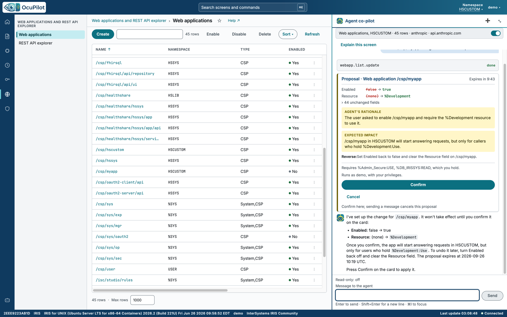
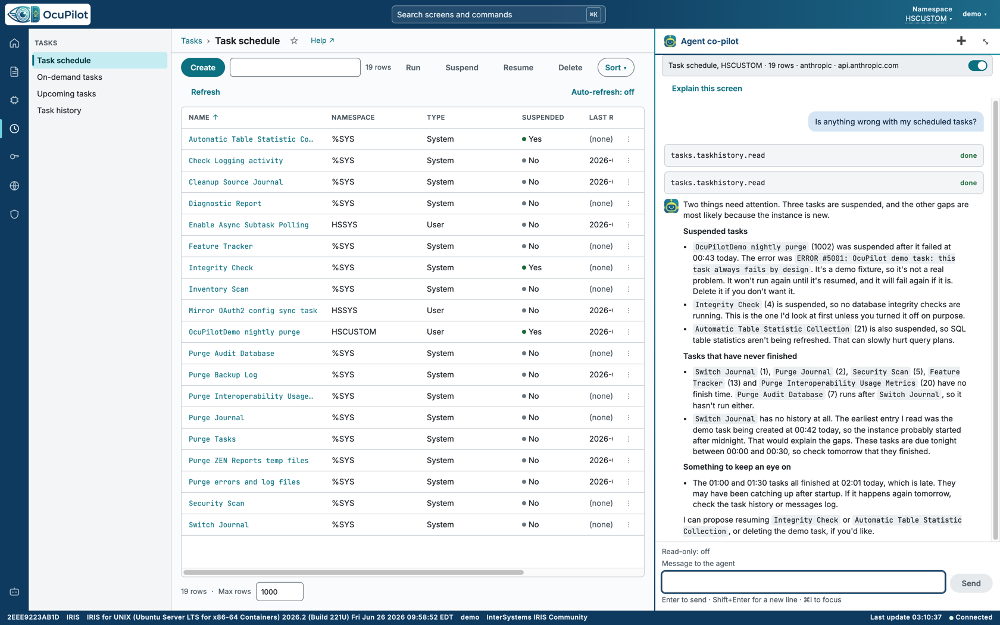
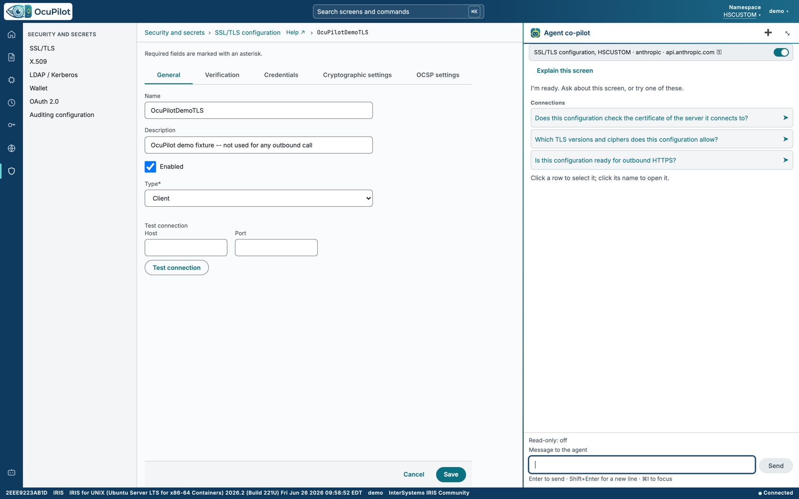
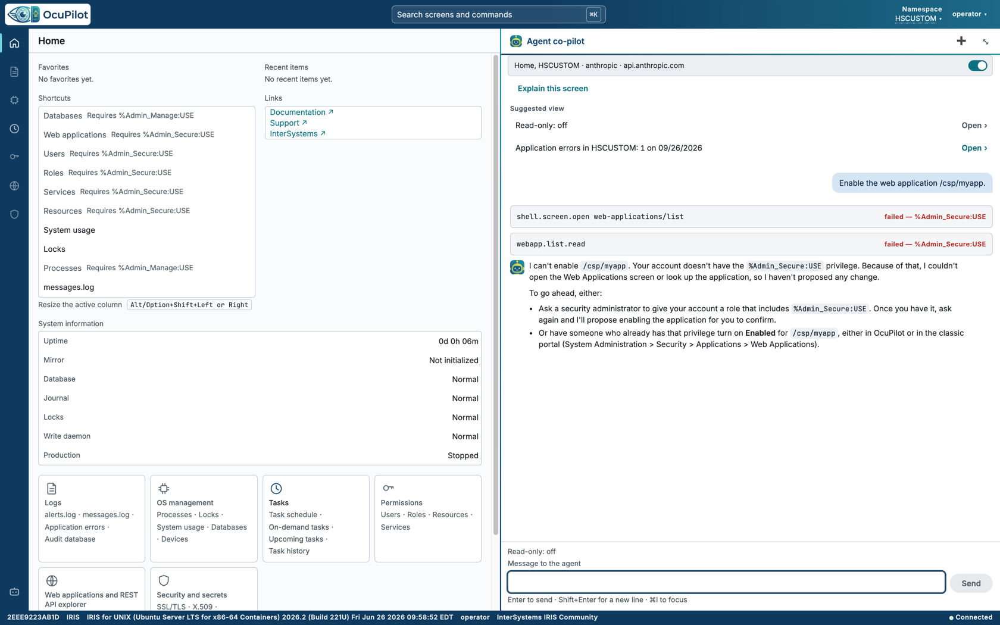
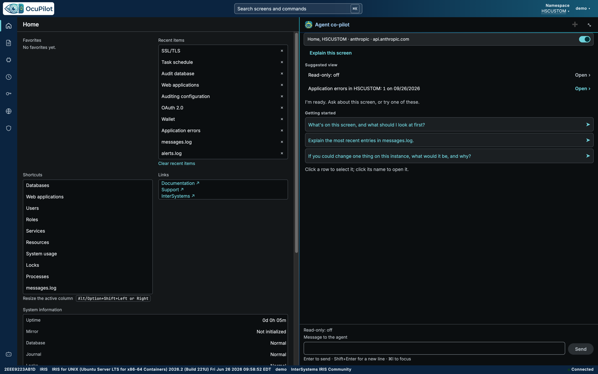
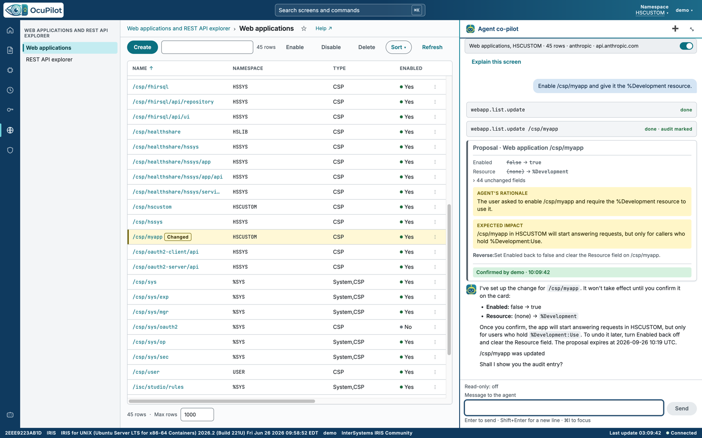
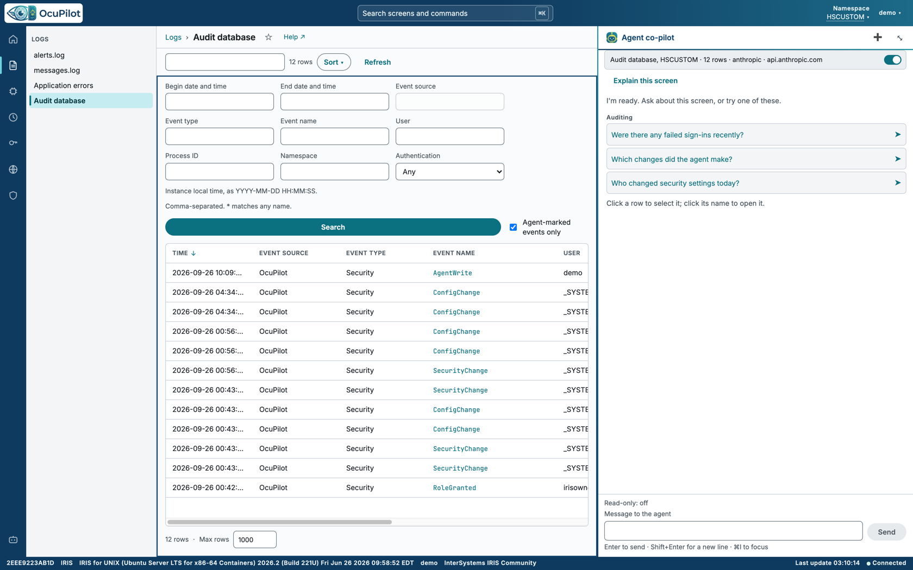

# OcuPilot

<p align="center">
  
</p>

<p align="center">
  <b>An agent co-pilot for the InterSystems IRIS System Management Portal.</b><br>
  A rebuilt portal for the six areas administrators live in, with an AI agent beside every screen.
</p>

<p align="center">
  <a href="https://ocupilot.org"><b>Live demo</b></a> ·
  <a href="#quick-start">Quick start</a> ·
  <a href="#get-a-model-key-in-two-minutes">Get a key</a> ·
  <a href="#a-change-from-question-to-audit-record">Walkthrough</a> ·
  <a href="docs/DEVELOPMENT.md">Developer reference</a>
</p>

OcuPilot is an Angular portal served from the IRIS instance itself, with an ObjectScript REST API
behind it. It covers the six areas named by InterSystems' ["Build Your Own Management
Portal"](https://openexchange.intersystems.com/contest/48) contest - web applications, permissions,
security and secrets, tasks, OS management and the logs - with list screens, row actions and full
editors that work against live instance data.

A panel docked on the right of every screen holds the agent. It sees the screen you are on, answers
questions about it from the rows in front of you, opens the screen a conversation is about, and
changes settings through tools that run strictly as you. **Every change it wants to make is shown as
a proposal you confirm; nothing changes until you press Confirm.** The change then runs with your own
privileges, is marked in the IRIS audit database as an agent write, and the screen refreshes and
marks the row that changed.

## Try it without installing

**[ocupilot.org](https://ocupilot.org)** runs the current release on a real IRIS for Health
instance. Sign in as `demo` with the password `ocupilot-demo`.

- The agent runs on Claude Opus 5.5, so you do not need a model key.
- Everyone shares the one instance, and it resets to a clean state every hour, on the hour.
- The `demo` account can administer all six areas. It cannot see or change the agent's own
  configuration, which holds the model key.
- To see how OcuPilot treats a user with fewer privileges, sign in as `operator` with the password
  `ocupilot-operator`: an operator who runs tasks and processes but holds no security privileges.



<details>
<summary><b>More screenshots</b></summary>

**Asking about the screen you are on** - the agent reads the task schedule and history and explains
what needs attention.



**Full editors** - here the SSL/TLS configuration editor, with its connection test.



**Fewer privileges, plainly explained** - signed in as `operator`, the agent declines a security
change and says what would be needed; Home marks the screens this user may not open.



**Light and dark** - every screen in both themes.



</details>

### A 90-second tour

1. Open **[ocupilot.org](https://ocupilot.org)**, choose **Open the demo** and sign in as `demo`.
2. Open **Web applications and REST API explorer → Web applications** from the rail on the left.
3. In the agent panel, ask: *"Enable /csp/myapp and give it the %Development resource."*
4. Read the proposal card: what changes, why, the privilege it needs and how to undo it.
5. Press **Confirm**. The list refreshes and marks `/csp/myapp` as Changed.
6. Open **Logs → Audit database**, tick **Agent-marked events only** and press **Search**: your
   change is there.
7. Sign out, sign in as `operator` / `ocupilot-operator`, and ask for the same change: the agent
   explains what that account would need instead.

## Why OcuPilot

- **Ask about what you are looking at.** The agent reads the screen you are on - the rows, the
  filter, the selected record - so "why is this task suspended?" or "which of these apps are
  unauthenticated?" is answered from the data in front of you, and every screen offers an
  **Explain this screen** prompt and suggested questions.
- **Changes are proposals, never surprises.** A write appears as a card with the target, an
  instance-computed before-and-after diff, the privilege it needs and how to reverse it. The agent
  cannot confirm its own proposal: Confirm comes only from you, in your browser or a script signed
  in as you.
- **It acts as you, and it is on the record.** A confirmed change runs with your roles, never an
  elevated service account. Each one is recorded in the IRIS audit database as
  `OcuPilot/Security/AgentWrite`, and the screen marks the changed row.
- **Guardrails that live on the instance.** OcuPilot refuses, on the server, changes that would
  lock you out or break it: the last `%All` holder, `_SYSTEM`, the signed-in user, the service
  accounts, OcuPilot's own applications, roles, resources and processes. An administrator can stop
  the agent everywhere with a kill switch, or hold it read-only.
- **Bring your own model.** Anthropic, OpenAI, Google Gemini, or any OpenAI-compatible endpoint -
  including a model on your own network, which keeps screen data and log text inside it.
- **A portal that feels current.** A VS Code-shaped shell, a command palette (`Ctrl+K`),
  favorites and recent items, resizable columns, per-screen help, and a light and a dark theme.

## The six areas

| Area | Screens | What you can do |
| --- | --- | --- |
| Web applications | Web applications, REST API explorer, OpenAPI document viewer | Create, edit, enable, disable and delete applications; browse every REST application's endpoints |
| Permissions | Users, roles, resources, services | Create and edit users and roles, set passwords, grant and revoke roles and resource permissions, enable and disable services |
| Security and secrets | SSL/TLS, X.509 credentials, wallet, OAuth 2.0 (client server descriptions, client configurations, resource servers, the authorization server, server client descriptions), LDAP, auditing | Editors for each, SSL/TLS and LDAP connection tests, OAuth token revocation, audit event configuration, and audit database copy and purge |
| Tasks | Task schedule, on-demand tasks, upcoming tasks, task history, task details | A New Task wizard, edit, run, suspend, resume and delete |
| OS management | Processes, process details, locks, system usage, databases, devices | Suspend, resume and terminate processes; edit devices; free space per database |
| Logs | `alerts.log`, `messages.log`, application errors, the audit database | Search and page each log, filter the audit database to agent writes, delete application errors, and ask the agent to explain any entry |

## Quick start

You need **Docker** (Docker Desktop on macOS or Windows, or Docker Engine with Compose v2 on Linux)
and nothing else.

```bash
git clone https://github.com/jbrandtmse/OcuPilot.git
cd OcuPilot
docker compose up -d --wait
```

The first start takes a few minutes: IRIS for Health Community starts, then the container compiles
and installs OcuPilot. `--wait` returns once the health check reports OcuPilot installed.

Then open **<http://localhost:52774/ocupilot/>** and sign in as `_SYSTEM` with the password `SYS`.
Community Edition ships the `_SYSTEM` password already expired; OcuPilot's first install clears that,
so you are not asked to change it.

The host ports are 52774 (web) and 1973 (SuperServer), one above the IRIS defaults, so OcuPilot can
run beside an IRIS container you already have. The classic Management Portal stays available at
<http://localhost:52774/csp/sys/UtilHome.csp>.

### Connect a model

The first time an administrator signs in with no model configured, OcuPilot opens the agent
definition form.

1. Enter a **Name**, choose a **Provider** and keep its default **Model** or type another.
2. Paste the **API key** (see [Get a model key](#get-a-model-key-in-two-minutes)).
3. Press **Test connection**. OcuPilot saves the definition, stores the key in the instance's
   credential store, and asks the model to reply.
4. Press **Save**, then choose **Enable** on the definition's row in **Agent co-pilot → Agent
   definitions**. The first definition you create becomes the default.

The key is never shown again: the field reads "Stored" and takes a new value only to replace it.
New definitions can propose changes; every change still waits for your Confirm.

### What the container also sets up

The Docker path installs a small set of demonstration objects, so every screen has something to show
and the agent has something to fix. The IPM install never creates them.

- `/csp/myapp`, a disabled web application with no resource
- `OcuPilotDemoTLS`, an SSL/TLS configuration, and `OcuPilotDemoCert`, a self-signed X.509
  credential
- `OcuPilotDemo.Sample`, a wallet collection
- "OcuPilotDemo nightly purge", a task that fails by design and is suspended after the error
- one application error, for the error log and the agent's explanations

To install without them, remove `OCUPILOT_DEMO: "1"` from `docker-compose.yml` before the first
start.

## Get a model key in two minutes

| Provider | Default model | Where to get a key |
| --- | --- | --- |
| Anthropic | `claude-opus-5-5` | [console.anthropic.com](https://console.anthropic.com/) → Settings → API keys |
| OpenAI | `gpt-5.6-terra` | [platform.openai.com/api-keys](https://platform.openai.com/api-keys) |
| Google Gemini | `gemini-3.8-flash` | [aistudio.google.com/apikey](https://aistudio.google.com/apikey) |
| OpenAI-compatible | none - you name it | Your own server: Ollama, vLLM, LM Studio and others |

- **Anthropic:** create the key **inside one workspace** (choose the workspace when you create it).
  A key that spans every workspace is refused unless the request names a workspace, which OcuPilot
  does not send; Anthropic's own message says so, and OcuPilot shows it.
- **OpenAI and Gemini:** a standard project key works as is.
- **Temperature:** OcuPilot sends none unless you set one under **Advanced**, and never to Anthropic,
  whose current models refuse sampling settings; OpenAI's default model accepts only its own value.
- **A local model:** choose **OpenAI-compatible**, set the endpoint - for Ollama on the same
  machine as Docker Desktop, `http://host.docker.internal:11434/v1` - tick **Local model** and
  **No API key**, and type the model name. A local model keeps screen data and log text on your
  network.
  - A model that is still loading can take longer to answer than Test connection waits, which is
    bounded by the IRIS Web Gateway's response timeout (60 seconds by default). Test connection
    then says "The model did not answer within 50 seconds. A local model may still be loading; test
    again in a minute." Test again once the model is warm, or raise the gateway's
    `Server_Response_Timeout` for a slow model; OcuPilot never changes that setting itself, and
    ordinary agent turns do not depend on it.
  - Size the model for what you ask of it: reading and explaining works with a modest model,
    while proposing changes needs one that forms multi-field tool calls reliably.

## Install into an existing instance with IPM

OcuPilot is also one IPM package. In the namespace you want it in (not `%SYS` or another system
namespace):

```objectscript
zpm "install ocupilot"
```

If IPM answers that no repositories are configured, run `zpm "enable -community"` once, then
install again.

Then open `/ocupilot/` on that instance's web server. Two things differ from the container path:
IPM never clears an expired `_SYSTEM` password, and it creates no demonstration objects. The
installer grants the `OcuPilotAdmin` role to the account that runs the install when that is a named
user; otherwise it prints the one command that grants it. OcuPilot needs IRIS or IRIS for Health
**2026.2 or later** and IPM 0.10.0 or later. On plain IRIS Community, which has no `HSCUSTOM`
namespace, the container installs into `USER`.

## What installing OcuPilot changes

OcuPilot is an administration tool, so it says plainly what it adds to an instance.

- **Its own database**, `OCUPILOT`, guarded by the `%DB_OCUPILOT` resource, which no ordinary role
  holds. Agent definitions, switches, the agent ledger and transcripts live there.
- **The `OcuPilotAdmin` resource and role**, which gate the agent's configuration. Using the agent
  needs no special role; configuring it does.
- **Three web applications:** `/ocupilot` (the portal's static files, served unauthenticated),
  `/api/ocupilot` (the REST API: password sign-in, JWT, no server session) and
  `/api/ocupilot/readiness`.
- **Two privileged routine applications**, `OcuPilotState` and `OcuPilotIdentity`, a global mapping
  and an SSL/TLS configuration, `OcuPilotProvider`, for model calls.
- **Auditing is switched on** if it was off, and OcuPilot registers its own audit events
  (`OcuPilot/Security/AgentWrite`, `ConfigChange`, `SecurityChange`, `RoleGranted`, `LedgerRead`).
  This is a deliberate change to the instance's security posture: an agent write that could not be
  audited would defeat the point.

Uninstalling (`zpm "uninstall ocupilot"`) removes what the installer created.

## A change, from question to audit record

1. **Open Web applications** and ask the agent: *"Enable /csp/myapp and give it the %Development
   resource."* If you ask from another screen, the agent opens this one first.
2. **The proposal card appears.** It names the target, shows the fields that change with their
   current and new values - computed on the instance from a fresh read, not by the model - the
   privilege the change needs, and how to reverse it.

   

3. **Press Confirm.** OcuPilot re-checks that you still hold the privilege, that the target has not
   changed since the proposal was made, and that the change is not prohibited, then runs it as you.
4. **The screen refreshes** and marks `/csp/myapp` as Changed; the panel shows the change done and
   audit-marked, confirmed by you.

   

5. **Open Logs → Audit database**, tick **Agent-marked events only** and press **Search**: the
   change is there as an `OcuPilot/Security/AgentWrite` event.

   

A proposal expires after ten minutes and can be confirmed once. It is refused if, in between, the
target changes, you are no longer the user who asked, or the conversation, the agent definition or
the read-only state changes.

## What the agent sees, and what it never sees

- **Screen context:** the screen you are on, its filter and selection, and up to 200 rows (an
  administrator can set 1 to 1,000), each field cut at 1,000 characters. A screen that holds
  secrets sends which record you are on, never its rows.
- **Your choice:** the **Share screen context** switch in the panel turns this off for you.
- **Secrets:** passwords, keys and wallet secrets are never given to the model. A change that needs
  one asks you for it on the proposal card, and it travels only with your Confirm.
- **Where it goes:** to the model provider you configured, and nowhere else. A definition marked
  local sends nothing off your network.

## From a script

Everything the portal does goes through OcuPilot's REST API at `/api/ocupilot`, which accepts your
IRIS user name and password, so the same work can be scripted. Reading a screen returns its rows:

```bash
curl -s -u demo:ocupilot-demo \
  "https://demo.ocupilot.org/api/ocupilot/screens/webapp.list/read?maxRows=5"
```

Asking the agent takes three calls: start a conversation, send a message, and follow the turn until
it completes. Any change it wants to make comes back as a proposal, which you confirm with your own
credentials:

```bash
B=https://demo.ocupilot.org/api/ocupilot
C=$(curl -s -u demo:ocupilot-demo -X POST -H 'Content-Type: application/json' -d '{}' $B/conversation | jq -r .conversationId)
T=$(curl -s -u demo:ocupilot-demo -X POST -H 'Content-Type: application/json' \
  -d "{\"conversationId\":\"$C\",\"message\":\"Which web applications are disabled?\"}" $B/turn | jq -r .turnId)
curl -s -u demo:ocupilot-demo $B/turn/$T/progress | jq '{state, reply, proposals}'
# once a proposal is shown:  curl -s -u demo:ocupilot-demo -X POST -H 'Content-Type: application/json' -d '{}' $B/proposal/<proposalId>/confirm
```

Against your own install, use `http://localhost:52774/api/ocupilot` and your own account.

## How it is built


<!-- Source: docs/images/09-architecture.mmd, rendered at 1600 px wide. Open Exchange does not render Mermaid. -->

- **One install, served by IRIS.** The portal is static files in `/ocupilot`; the API, the agent
  runtime and the proposal store are ObjectScript classes in the install namespace. There is no
  separate server to run.
- **The instance is the source of truth.** Screens read live data through IRIS's own management
  APIs, and the agent's tools are derived from the same screen descriptors, so the agent and the
  screen see the same thing.
- **The model never writes.** An agent turn runs in a background job that can only read and
  propose. Writes happen in a separate request that only your Confirm makes.

## Quality

- **Continuous integration on every push:** five GitHub Actions jobs build and test the client on
  each supported Node release, run the full ObjectScript suite against a fresh IRIS container, drive
  the portal in headless Chrome, compile and smoke-test on both IRIS Community and IRIS for Health
  Community, and build and load the IPM package offline.
- **Tests:** 287 `%UnitTest` classes run inside IRIS; 76 Node test files and 106 Angular component
  specs cover the client; 92 browser specs exercise the running portal.
- **A smoke test you can run:** `bash scripts/smoke.sh --container ocupilot --user _SYSTEM
  --password SYS` asks the running instance whether OcuPilot works; the assertions live inside
  IRIS, so CI and your machine ask the same question.

## Troubleshooting

- **HTTP 401 from everything on a fresh container:** the `_SYSTEM` password is still expired. The
  first install clears it, so this usually means an older `iris-data/` folder was reused. Clear it
  with:

  ```bash
  docker compose exec -T iris iris session iris -U "%SYS" '##class(Security.Users).UnExpireUserPasswords("_SYSTEM")'
  ```

- **`docker compose up --wait` reports the container unhealthy:** run `docker compose logs iris` and
  look for the `container-start:` lines. `LOAD-FAILED` means a compile error, `STARTPATH-FAILED`
  names the install step that failed. A failed install is retried three times and then left
  stopped; fix the cause and run `docker compose up -d --wait` again.
- **Test connection says the model did not answer in time:** see the local-model note under
  [Get a model key](#get-a-model-key-in-two-minutes).
- **Anthropic refuses the key:** create a key inside one workspace.
- **Ports 52774 or 1973 are taken:** change the host side of the two port mappings in
  `docker-compose.yml`.

## Community ideas

OcuPilot implements two ideas from the [InterSystems Ideas portal](https://ideas.intersystems.com/)
that carry Community Opportunity status:

- [DPI-I-516](https://ideas.intersystems.com/ideas/DPI-I-516), **Integration with LLMs like GPT,
  llama:** the agent runs on OpenAI's GPT models, Anthropic's Claude, Google Gemini, or a local
  model such as Llama served by Ollama, vLLM or LM Studio.
- [DPI-I-574](https://ideas.intersystems.com/ideas/DPI-I-574), **AI analysis of error logs:** the
  agent explains any application error, `messages.log` line, alert or audit record in front of it
  and suggests what to do next.

## Known limitations

- **One instance at a time.** OcuPilot manages the instance it is installed on.
- **Not every portal page yet.** Namespaces, database configuration, journals, mirroring and
  Interoperability are still the classic portal's; the LDAP and Kerberos and the service editors
  cover the common fields and link to the classic page for the rest.
- **A model is needed for the agent.** Every screen works without one; the agent needs a key or a
  local model. A turn that makes a change can take up to a minute, and a small local model may
  propose changes that need correcting.
- **IRIS 2026.2 or later.** OcuPilot relies on the admin API that version introduced.
- **Auditing must be on for the audit record.** If it is switched off, the agent's changes still
  need your Confirm, and the panel says plainly that they are not being marked.
- **English only.**

## Roadmap

Improvements continue through the contest's voting week, released to `main` in tested batches:

- a try-it console that sends a request from the REST API explorer;
- a read-back line showing that the instance now holds what a change wrote;
- a performance row on Home, and impact lines on removals ("3 users hold this role");
- older `messages.log` files in the Logs area ([DPI-I-966](https://ideas.intersystems.com/ideas/DPI-I-966));
- the remaining log viewers and a unified log hub;
- the agent handing you a script instead of running a change, and tests that content the agent
  reads cannot steer it.

Beyond the contest, OcuPilot grows toward parity with the classic portal: the rest of the admin API
(namespaces, databases, journals, encryption), a code and SQL explorer, Interoperability, and every
remaining portal page.

## Developing OcuPilot

[docs/DEVELOPMENT.md](docs/DEVELOPMENT.md) is the contributor reference: the development container
and its start path, the installer, the smoke script and CI, the IPM manifest, VS Code setup and the
IRIS MCP server suite. Building the client needs Node `^22.22.3`, `^24.15.0` or `^26.0.0`.

OcuPilot was planned and built with the [BMAD Method](https://github.com/bmad-code-org/BMAD-METHOD),
with Claude Code as the development agents: research, a product brief and PRD, UX design and an
architecture spine first, then every story through the same spec, implementation, QA, code review
and CI cycle. The planning documents are under
[_bmad-output/planning-artifacts/](_bmad-output/planning-artifacts/).

## License

MIT - see [LICENSE](LICENSE). Third-party material redistributed with OcuPilot is listed in
[ATTRIBUTIONS.md](ATTRIBUTIONS.md).
