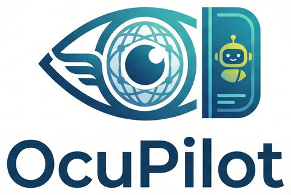

# OcuPilot

<p align="center">
  
</p>

**OcuPilot is an agentic System Management Portal for InterSystems IRIS** — an Angular rebuild of the
IRIS Management Portal, served from the IRIS instance itself, built around an **agent co-pilot**: a
panel docked on the right of every screen, the way VS Code docks its secondary side bar. The agent
knows which screen the user is looking at, answers questions about it, and changes settings through
tools that run strictly as the logged-in user — every write it proposes is shown, reviewed, and
confirmed before it runs.

It's being built for InterSystems' [**"Build Your Own Management
Portal"**](https://openexchange.intersystems.com/contest/48) programming contest
([announcement](https://community.intersystems.com/post/intersystems-programming-contest-build-your-own-management-portal)),
Open Exchange contest 48 — submissions close **2026-09-27 23:59 EST**. The contest names six portal
areas, and OcuPilot rebuilds all six as screens wired live to IRIS's own REST management APIs, chiefly
the hidden `/api/admin` v2 service:

- Web applications and a REST API explorer
- Users, roles, resources, and services (permissions)
- Security and secrets — SSL/TLS, X.509, LDAP, OAuth 2.0, wallet, and audit configuration
- Task scheduling and history
- OS management — processes, locks, system usage, CPU/memory, databases, and devices
- The logs

Only a handful of endpoints (`messages.log`, the application error log, the agent runtime) are new
server code — the rest is UI and an agent layered over an API IRIS already exposes. The agent is
bring-your-own-model: OpenAI, Anthropic, Google Gemini, or any OpenAI-compatible endpoint, including
local models, configured on first login. OcuPilot installs as one IPM module, and the Docker Compose
workspace in this repo self-installs it on start; it runs on IRIS Community and IRIS for Health
Community.

Past the contest, the goal is full parity with the classic System Management Portal, harvesting from
sibling projects — **iris-session-agent** for the agent core and
[**iris-execute-mcp-v2**](https://github.com/jbrandtmse/iris-execute-mcp-v2) for its governance model —
until OcuPilot is the administration portal InterSystems itself points at.

**Status:** planning is complete and implementation is starting under [src/OcuPilot/](src/OcuPilot/).
See the [original idea](docs/initial-idea.md), the [research
report](_bmad-output/planning-artifacts/research/technical-ocupilot-portal-feature-landscape-2026-09-08/research.md),
the [feature
catalog](_bmad-output/planning-artifacts/research/technical-ocupilot-portal-feature-landscape-2026-09-08/feature-catalog.md),
and the [product brief](_bmad-output/planning-artifacts/briefs/brief-OcuPilot-2026-09-08/brief.md) for
the full plan.

## Development sandbox

This repo doubles as the **InterSystems IRIS for Health Community Edition** sandbox OcuPilot is built
and tested against — one Docker Compose service with **durable storage**, wired up two ways: for VS
Code, so ObjectScript editing, compiling, and debugging work out of the box; and for agents — Claude
Code, Copilot, Cursor — via the [IRIS MCP server suite](#optional-iris-mcp-server-suite), which gives
them direct tooling for development, administration, interoperability, operations, and data against
this instance. A throwaway IRIS an agent can safely drive, break, and rebuild.

The `HSCUSTOM` namespace is the default target for everything here.

## What this project is

| Piece | Purpose |
| --- | --- |
| [src/OcuPilot/](src/OcuPilot/) | Project ObjectScript source — classes, includes, and eventually the IPM module manifest. The container start hook loads and compiles this whole tree on every start; see [Project source layout](CLAUDE.md#project-source-layout) |
| [docs/initial-idea.md](docs/initial-idea.md) | The owner's original project brief |
| [_bmad-output/planning-artifacts/](_bmad-output/planning-artifacts/) | Research, feature catalog, and product brief produced by the BMAD Method planning process |
| [logo/](logo/) | The OcuPilot logo, full-size and web-optimized |
| [docker-compose.yml](docker-compose.yml) | Runs `intersystems/irishealth-community` at the explicit `2026.2` tag as `ocupilot`, publishing 1973→1972 (SuperServer) and 52774→52773 (Management Portal), with `ISC_DATA_DIRECTORY=/durable/iris`, the `--after` start hook and the install health check |
| [scripts/container-start.sh](scripts/container-start.sh) | The `--after` start hook: resolves the install namespace, compiles `src/OcuPilot/`, calls `Installer.StartPath`, exits non-zero on failure |
| [scripts/container-health.sh](scripts/container-health.sh) | The compose health probe: reports healthy only once `Installer.GateStatus()` reads `installed` at the deployed schema version |
| [iris-data/](iris-data/) | The durable-storage bind mount (`./iris-data` → `/durable`). Tracked in git as an empty folder — see [Durable storage](#durable-storage) |
| [ocupilot.code-workspace](ocupilot.code-workspace) | The `intersystems.servers` definition for the container — the connection profile Server Manager and the ObjectScript extension resolve against |
| [.vscode/settings.json](.vscode/settings.json) | The `objectscript.conn` that references that profile, including the `active` toggle — see [VS Code / ObjectScript setup](#vs-code--objectscript-setup) |
| [LICENSE](LICENSE) | MIT |

## Prerequisites

- **[Docker Desktop](https://www.docker.com/products/docker-desktop/)** (or any Docker Engine with Compose v2) — running before you start.
- **[InterSystems ObjectScript Extension Pack](https://marketplace.visualstudio.com/items?itemName=intersystems-community.objectscript-pack)** for VS Code (extension ID `intersystems-community.objectscript-pack`). This bundles the ObjectScript language server, the Server Manager, and the InterSystems Language Server.

## Bringing the container up

```bash
# from the project root
docker compose up -d --wait
```

One command, first time, on a clean clone (FR-67): this pulls the image (pinned to an explicit
`2026.2` tag, never the vendor's rolling nightly-build alias — see [Installer: protected state,
auditing and the start path](#installer-protected-state-auditing-and-the-start-path)), initializes
the instance into `./iris-data`, and then runs OcuPilot's own install to completion before the
container reports healthy. `--wait` blocks until that health check passes rather than returning as
soon as the container starts, so the command's own exit is the "installed and reachable" signal —
no separate "watch the log until it looks done" step. First start takes a few minutes; watch
progress with:

```bash
docker compose logs -f iris
```

### Verify

- **Management Portal:** <http://localhost:52774/csp/sys/UtilHome.csp>
- **Credentials:** `_SYSTEM` / `SYS` — install unexpires this account's password on first install
  (see below), so there is no manual step and no forced change-password prompt.
- **Namespace:** `HSCUSTOM`
- **Shell into the instance:** `docker compose exec iris iris session iris -U HSCUSTOM`
- **Confirmed authenticated:** `curl -I -u _SYSTEM:SYS http://localhost:52774/api/atelier/` →
  `HTTP 200`, which is also the check that proves the password is unexpired.

### Everyday commands

```bash
docker compose stop        # stop, keep the data
docker compose start       # start again
docker compose restart     # restart
docker compose down        # remove the container (data in ./iris-data survives)
docker compose ps          # status
```

To start completely fresh, `docker compose down` and then delete the contents of `./iris-data` (keeping
`.gitkeep`) before bringing it back up.

## Durable storage

`ISC_DATA_DIRECTORY=/durable/iris` tells IRIS to keep its databases, journals, and configuration on the
bind-mounted `./iris-data` directory instead of inside the container's writable layer, so the instance
survives `docker compose down` and image upgrades.

Those files are machine-local instance state and must never be committed. [.gitignore](.gitignore) keeps
the folder in the repository while ignoring everything in it:

```gitignore
iris-data/*
!iris-data/.gitkeep
```

So a fresh clone gets an empty `iris-data/` ready to be populated on first `docker compose up`.

## Installer: protected state, auditing and the start path

`OcuPilot.Install.Installer` (Story 1.3) creates OcuPilot's own protected state — a dedicated
database, guarded by a `%DB_` resource no ordinary role holds, plus the `OcuPilotAdmin`
resource and role, a privileged routine application, and a global mapping — so agent
definitions, switches, the ledger and transcripts land somewhere a holder of
`%DB_<install-namespace>:RW` plus `%Admin_Operate` cannot read or forge (AD-9, FR-29).

That protects the **data**, and only the data. OcuPilot's **code** deliberately stays in the
install namespace's ordinary database, because in IRIS database READ *is* routine-execution
permission and hiding the packages would make OcuPilot unrunnable by exactly the users it is
for. So the same `%DB_<install-namespace>:RW` holder can still rewrite
`OcuPilot.Kernel.State.Base`, the one class the privileged routine application whitelists, and
reach the protected globals that way. Code integrity is a separate control (source review,
deployment discipline), not something this database boundary provides — see AD-9.

As a deliberate security-posture change, install also **enables instance auditing** if it is
off and registers OcuPilot's own audit event (`OcuPilot/Security/RoleGranted`) under
`Security.Events` — a Community Edition container that has never had auditing touched starts
producing audit rows for OcuPilot's writes from its first install onward (FR-66).

Install grants the `OcuPilotAdmin` role to the installing user when that user is a real named
account. When it is not — an empty identity, `UnknownUser`, `_PUBLIC`, or any name that does
not resolve to an account on this instance — the grant is skipped (never silently) and the run
reports the exact command an operator must run to grant it by hand:

```objectscript
Set $NAMESPACE="%SYS" Set tRoles="OcuPilotAdmin" Do ##class(Security.Users).AddRoles("<a named account that exists on this instance>", .tRoles)
```

The `%SYS` switch is not optional: `Security.Users` is mapped into `%SYS` only, so without it
the command raises `<CLASS DOES NOT EXIST>` in the install namespace. And the target is always
supplied by the operator — the installer never names a rejected placeholder back as something
to grant to, since granting OcuPilot's administrative role to `UnknownUser` would hand it to
every anonymous caller (AD-21).

`Uninstall(profile, 1)` reverses the objects above — mapping, application, role, both
resources, the database config entry, `IRIS.DAT`, the directory and the audit event
registration. It **does not** turn instance auditing back off: other event types depend on it,
and that switch was an instance-wide posture change rather than one of OcuPilot's own objects.
Without `pConfirmDataLoss = 1` the call changes nothing and returns an error naming what it
would have destroyed.

### The container start path (Story 1.4)

`docker-compose.yml`'s `--after` hook (`scripts/container-start.sh`) resolves the install
namespace, loads and compiles `src/OcuPilot/` from a read-only bind mount, and calls
`OcuPilot.Install.Installer.StartPath(pDemo)` — the single entry point the container uses.
`StartPath` runs `Install("")`, then, only on success and only when `OCUPILOT_DEMO` is `"1"` in
the environment (this repository's own `docker-compose.yml` sets it), creates the five opt-in
demo walkthrough fixtures (AD-25) through `OcuPilot.Install.Fixture`. Because upgrade is "install
again" (AD-17), this runs on **every** container start against the same durable volume, not only
the first.

Install does not wait for the demo task fixture (`OcuPilotDemo nightly purge`). It schedules the
task and asks the Task Manager for one run, and the Task Manager runs it at its next once-a-minute
pass, where the task fails by design and suspends itself. The container can therefore report
healthy up to a minute before that task shows as suspended after an error.

Before any web application accepts traffic, `OcuPilot.Api.Router`'s `OnPreDispatch` checks a
version stamp (`OcuPilot.Kernel.State.Version`) and refuses with a `503` envelope
(`INSTALL.INSTALLING`, `INSTALL.FAILED` or `INSTALL.UPGRADEREQUIRED`) until the stamp reads
`installed` at the deployed schema version (AD-38) — a request arriving mid-install finds a
clear refusal, never half a schema. The compose `healthcheck` reads the same stamp through
`iris session` (the image ships no HTTP client at all) and reports healthy only once it says
`installed`.

A stored schema version newer than the deployed code (a downgrade) is refused outright, naming
both versions and changing nothing; a stored version behind the deployed code runs every
registered migration step in ascending order before the phase becomes `installed`.

Invoking the installer directly through the IRIS MCP tools — `iris_execute_classmethod` on
`OcuPilot.Install.Installer`, method `Install` or `StartPath`, against the `ocupilot-iris` server
profile and the `HSCUSTOM` namespace — still works and is how Story 1.3 verified this class
before the start hook existed; the container path above is what a clean clone actually uses.

### Verifying the start path against a throwaway container

The running `ocupilot` container and its `./iris-data` volume hold state every later story
depends on and must never be reset, restarted, or recreated to test this. Verifying the pin, the
one-command bring-up, and the "fails loudly" behavior instead uses a **throwaway** Compose
project — its own project name, its own scratch data directory, its own host ports (never
52774/1973) — for example:

```bash
docker compose -p ocupilot-fresh -f docker-compose.yml -f <scratch-dir>/override.yml up -d --wait
# ... assert against the throwaway container only ...
docker compose -p ocupilot-fresh -f docker-compose.yml -f <scratch-dir>/override.yml down -v
```

where the override file sets its own `container_name`, remaps `ports` to something else entirely
(e.g. `52776:52773` / `1975:1972`) and points the `/durable` volume at a scratch directory instead
of `./iris-data`. Write the ports as `ports: !override [...]`: Compose concatenates port lists
across files, so a plain override still publishes 52774/1973 as well and the throwaway fails to
start (verified with `docker compose config`). Volumes merge by their container path, so a
`/durable` entry replaces the real one. Never omit `-p` and never point a throwaway project at
the real bind mount.

## VS Code / ObjectScript setup

Open [ocupilot.code-workspace](ocupilot.code-workspace) (**File → Open
Workspace from File…**) rather than the plain folder. This matters for more than convenience — see
[Where the `active` toggle lives](#where-the-active-toggle-lives) below.

The connection is expressed the way the [InterSystems Settings
Reference](https://docs.intersystems.com/components/csp/docbook/DocBook.UI.Page.cls?KEY=GVSCO_settings)
prescribes — a named **server profile**, referenced by name from the connection — split across two files:

| File | Scope | Setting | Holds |
| --- | --- | --- | --- |
| [ocupilot.code-workspace](ocupilot.code-workspace) | Workspace | `intersystems.servers` | The `ocupilot-iris` profile: `webServer` scheme/host/port, `superServer` port, `username` |
| [.vscode/settings.json](.vscode/settings.json) | Workspace Folder | `objectscript.conn` | `server` (the profile name), `ns`, `active` |

```jsonc
// ocupilot.code-workspace
"intersystems.servers": {
  "ocupilot-iris": {
    "webServer": { "scheme": "http", "host": "localhost", "port": 52774 },
    "superServer": { "port": 1973 },
    "username": "_SYSTEM"
  }
}

// .vscode/settings.json
"objectscript.conn": {
  "server": "ocupilot-iris",
  "ns": "HSCUSTOM",
  "active": false        // ← flip this to connect
}
```

`active` ships as **`false`** on purpose, so opening the workspace never attempts a connection to a
container that may not be running. Flip it here, or use the ObjectScript status-bar item — which writes to
this same file.

**No password is stored in the repo.** Server Manager prompts on first connect and saves it in your OS
keychain; an inline `password` property is deprecated by the extension.

### Why a server profile rather than inline host/port

`objectscript.conn` also accepts `host`, `port`, and `https`, but the extension's connection resolver
**never reads them**. It has exactly two branches:

```js
let s = (conn["docker-compose"] && extensionKind !== ExtensionKind.Workspace)
        || !conn.server
        || !config("intersystems.servers", folder).has(conn.server)
      ? "" : conn.server;

if (s !== "") {
  // resolve scheme/host/port/pathPrefix/auth/superServer from intersystems.servers[s]
} else if (conn["docker-compose"]) {
  // probe the running container for its mapped port
}
// ← no third branch: inline host/port is dead config
```

Hence the docs' note on `objectscript.conn.server`: *"Specify only `ns` and `active` when using this
setting."* Note the first clause too — a `docker-compose` block **outranks** `server`, so the two are
mutually exclusive rather than complementary. This project publishes fixed ports (1973, 52774) on
`localhost`, so the profile names them directly and no `docker-compose` block is used.

### The profile name must not match the workspace folder name

Non-obvious, and it silently breaks the `active` toggle. `AtelierAPI.setConnection` starts by testing the
**workspace folder name** against `intersystems.servers`:

```js
let s = configName.toLowerCase();                       // configName = the workspace FOLDER name
if (config("intersystems.servers", configName).has(s)) {
  this.externalServer = true;                           // ← folder name matches a server name
} else {
  s = (...) ? "" : conn.server;
}

this._config = {
  serverName: s,
  active: this.externalServer
        ? !inactiveServerIds.has(s)                     // ← conn.active is IGNORED
        : conn.active,                                  // ← conn.active is honored
  ...
};
```

A match puts the folder in **`externalServer`** mode — intended for server-side `isfs` folders named after
a server — where `active` is read from `inactiveServerIds`, an in-memory set populated only at runtime by
connection failures. Your `"active": false` is parsed and then discarded, so the file watcher's gate
(`api.active && syncLocalChanges != "off"`) stays open and sync keeps running. The write path is guarded
the same way (`externalServer || await Se(...)`, where `Se` persists `conn.active`), so the extension
never records the toggle either.

This folder is `OcuPilot` — which lowercases to `ocupilot` — so the profile is named
**`ocupilot-iris`** to stay clear of it. If you rename the directory, check it still differs from the
profile name.

> This bit us once already: the project was renamed from `iris-community-edition` to `OcuPilot` and the
> profile renamed to `ocupilot` at the same time, which collided and silently re-armed the watcher. The
> symptom is that `"active": false` has no effect *and* **Toggle Connection** vanishes from the command
> menu — `externalServer || x.push({... "Disable current connection" ...})` never pushes the item.

### Where the `active` toggle lives

The toggle is in `.vscode/settings.json` deliberately. The extension picks its write target by inspecting
which scope already defines `objectscript.conn`:

```js
const target = config.inspect("conn").workspaceFolderValue
  ? ConfigurationTarget.WorkspaceFolder   // → .vscode/settings.json
  : ConfigurationTarget.Workspace;        // → the .code-workspace file
config.update("conn", { ...existing, active: newValue }, target);
```

Because `.vscode/settings.json` defines the whole `objectscript.conn` object, that first branch always
wins: every connect/disconnect lands there and never churns the shared workspace file. Keeping the object
*complete* at folder scope also means nothing depends on VS Code merging one setting across two files.

This depends on opening the **workspace file**. A folder opened directly makes `.vscode/settings.json`
*Workspace* scope, leaving `workspaceFolderValue` undefined and sending the toggle back to the
`.code-workspace` — and worse, the `.code-workspace` file's own settings are not loaded at all, so the
`intersystems.servers` profile would go missing entirely. Opening a `.code-workspace` — even one with a
single folder entry, as here — is what makes `.vscode/settings.json` *Folder* scope.

### Reaching the gitignored reference folders from Claude Code

`irislib/`, `irissys/`, `irisui/` and `irisdocs/` are gitignored (they are regenerable container
exports, not source), but they are exactly the material worth searching and `@`-mentioning. The
Claude Code VS Code extension filters `.gitignore` matches out of its file searches by default, so
out of the box none of those ~25,000 files can be `@`-mentioned, and opening one does not even share
the active file or selection with Claude — the extension suppresses that context for git-ignored
files. The workspace turns the filter off:

```jsonc
// ocupilot.code-workspace
"claudeCode.respectGitIgnore": false
```

It belongs in the `.code-workspace` file, not `.vscode/settings.json`: the setting is *window*-scoped,
and window-scoped keys at folder scope are ignored — the same "open the workspace file, not the
folder" dependency as everything above.

Exclusions other than `.gitignore` still apply with the filter off — `search.exclude`,
`files.exclude`, and a `.ignore` file — so individual paths can be put back out of reach without
turning the setting back on. This changes only what the editor will *search and show*; the folders
remain read-only and must never be loaded into IRIS (see
[.claude/rules/reference-folders.md](.claude/rules/reference-folders.md)).

## Optional: IRIS MCP server suite

The [iris-execute-mcp-v2](https://github.com/jbrandtmse/iris-execute-mcp-v2) suite gives AI coding
assistants (Claude Code, Copilot, Cursor) direct tooling against this container — five MCP servers
covering dev, admin, interop, ops, and data.

It is **not vendored into this repo** — it gets cloned and built wherever you keep checkouts.

### The easy way: let Claude Code do it

If you use [Claude Code](https://claude.com/claude-code), you do not have to run any of the registration
commands yourself — hand it the job. Open this project in Claude Code and paste:

```text
Set up the IRIS MCP server suite for this project.

1. Clone https://github.com/jbrandtmse/iris-execute-mcp-v2 if I don't already have a
   checkout, then build it: `pnpm install && pnpm turbo run build` (needs Node 18+ and
   pnpm 9+; install pnpm with `npm install -g pnpm` if it's missing).
2. Register all five servers -- iris-dev, iris-admin, iris-interop, iris-ops, iris-data --
   with `claude mcp add` at **user** scope, so they're available in every project.
   Each one runs `node <checkout>/packages/iris-<name>-mcp/dist/index.js`.
3. Point them at the container this repo's docker-compose.yml starts, using these
   environment variables:
   IRIS_HOST=localhost, IRIS_PORT=52774, IRIS_USERNAME=_SYSTEM, IRIS_PASSWORD=SYS,
   IRIS_NAMESPACE=HSCUSTOM, IRIS_HTTPS=false
   If I've already changed the _SYSTEM password, ask me for the current one instead of
   using SYS.
4. Make sure the container is up (`docker compose up -d`) and confirm the result with
   `claude mcp list`.

Tell me what you changed and what I need to restart.
```

Claude Code will need to be restarted afterwards for the new servers to load.

### Manual registration (Claude Code CLI)

> Both this section and the one above are **specific to Claude Code** — `claude mcp add` is the Claude
> Code CLI. For any other MCP client (Copilot, Cursor, Cline, Claude Desktop, …), configure the same five
> commands and environment variables in that client's own MCP config, or use the suite's
> `iris-mcp-clients` CLI / the IRIS MCP Launcher extension, which wire up 13 supported clients for you.

Clone and build the suite (Node.js 18+ and pnpm 9+ required):

```bash
git clone https://github.com/jbrandtmse/iris-execute-mcp-v2.git
cd iris-execute-mcp-v2
pnpm install
pnpm turbo run build
```

Then register the servers with **user scope** so they are available in every project, pointed at this
container with `HSCUSTOM` as the default namespace. One per server (`iris-dev`, `iris-admin`,
`iris-interop`, `iris-ops`, `iris-data`):

```bash
REPO=/path/to/iris-execute-mcp-v2
for s in dev admin interop ops data; do
  claude mcp add "iris-$s" -s user \
    -e IRIS_HOST=localhost -e IRIS_PORT=52774 \
    -e IRIS_USERNAME=_SYSTEM -e IRIS_PASSWORD=SYS \
    -e IRIS_NAMESPACE=HSCUSTOM -e IRIS_HTTPS=false \
    -- node "$REPO/packages/iris-$s-mcp/dist/index.js"
done
```

Verify with `claude mcp list`. The container must be up for the servers to connect.

## License

[MIT](LICENSE).
