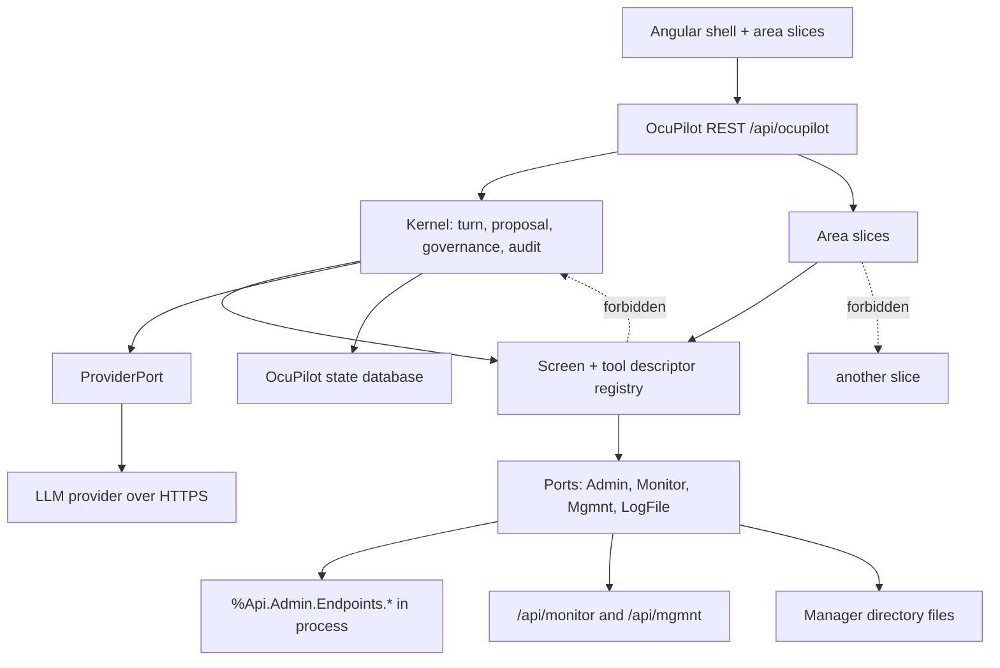
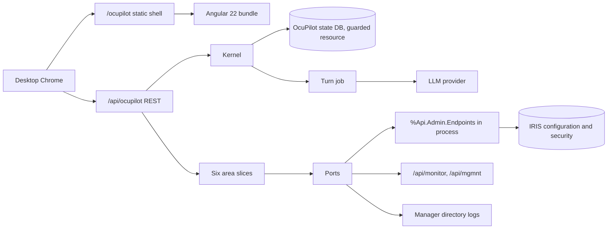
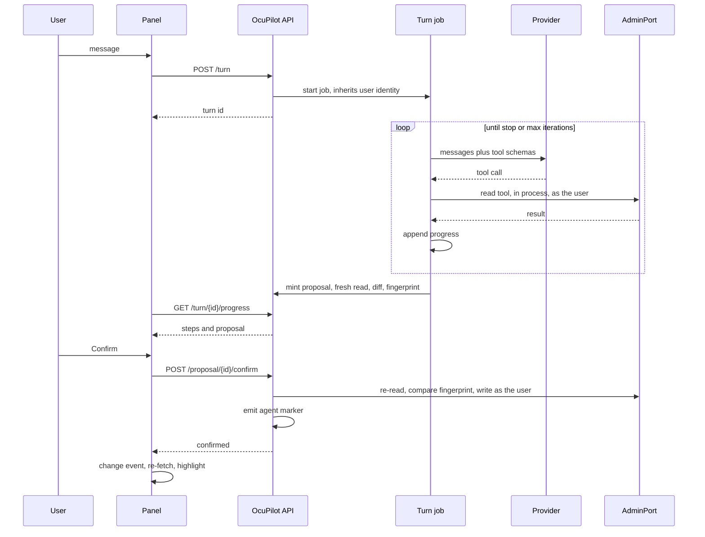
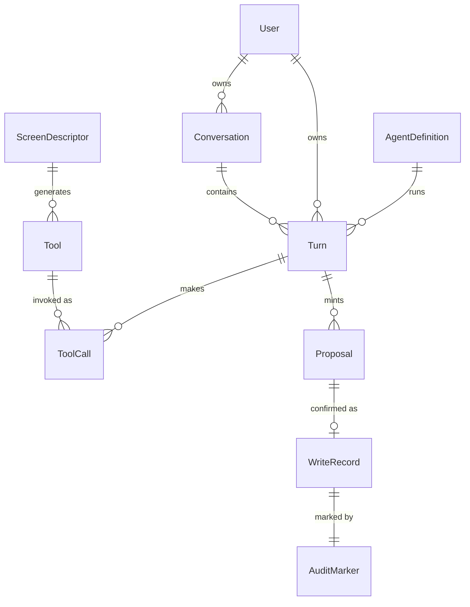

# Architecture Spine — OcuPilot

## How to use this spine

**Read all of it before writing code — every AD, not the ones that look relevant to your area.** The invariants here exist because two units built independently would otherwise diverge, so the ones that matter to you are frequently the ones written for somebody else: the slice that owns an entity you also touch, the kernel rule your screen has to satisfy, the port whose gate your read depends on. An AD skimmed is an AD violated.

This is a contract, not a backlog. Where an AD constrains you, follow it; where you believe it is wrong, say so and change it here first, rather than working around it in a slice. Reviews that produced these decisions are in `reviews/`; the reasoning behind each is in `.memlog.md`; the file-level plan for reused sibling code is in `harvest/`.

## Design Paradigm

**Descriptor-driven vertical slices, hexagonal at the edges.**

One **slice per portal area** (web apps, permissions, security and secrets, tasks, OS management, logs), each owning its screens, tools and tests end to end. A slice never reaches into another slice; shared behavior lives in the shell or the kernel.

Every screen in a slice is declared by exactly one **screen descriptor**. That descriptor is the single source from which the route, the navigation entry, the privilege gate, the read tool, the write tools, the screen-context serializer and the change-event key are all derived. Sixty screens stay consistent because there is only one place to be consistent in.

Everything outside OcuPilot is reached through a **port**, each with exactly one adapter: `AdminPort` (the admin API's endpoint objects, in-process), `MonitorPort` (`/api/monitor`), `MgmntPort` (`/api/mgmnt`, the REST explorer), `LogSourcePort` (every log source the admin API does not back — the manager directory's files and the `^ERRORS` global), and `ProviderPort` (the LLM, outbound HTTPS). Nothing else crosses the boundary, and a slice never speaks to an outside system except through a port.

| Paradigm element | Where it lives |
| --- | --- |
| Slice | `src/OcuPilot/Area/<Area>/` + `ui/src/app/areas/<area>/` |
| Screen descriptor | `src/OcuPilot/Screen/Descriptor/<Area><Screen>.cls`, mirrored to the client as generated TypeScript |
| Kernel (shell, agent, proposal, audit, governance) | `src/OcuPilot/Kernel/` |
| Ports | `src/OcuPilot/Port/` — `AdminPort`, `MonitorPort`, `MgmntPort`, `LogSourcePort`, `ProviderPort` |

## Invariants & Rules



Dependency direction: UI → API → (Kernel, Slice) → Registry → Ports → outside. A slice never depends on another slice. The registry never depends on the kernel. Nothing depends on the UI.

### AD-1 — Agent tools execute in-process, never over HTTP  `[ADOPTED]`

- **Binds:** every read and write tool; FR-16, FR-17, FR-18; PRD Open Question 17
- **Prevents:** a second authenticated hop inside a turn, and with it the 60-second access-token versus 90-second turn mismatch, a token-refresh path, and a per-tool HTTP cost
- **Rule:** A tool body runs in the calling process and calls the IRIS management surface directly. No tool issues an HTTP request to `/api/admin`, `/api/mgmnt` or `/api/ocupilot`. Because the process already carries the user's `$USERNAME` and `$ROLES`, "runs as the user" is a property of the process, not something a token has to assert.

### AD-2 — The AdminPort invokes the vendor's own endpoint objects, with stub CSP state

- **Binds:** every tool and every screen read backed by an admin API route; areas 5.5–5.10
- **Prevents:** reimplementing 70 vendor endpoints; divergence between what a screen shows and what a tool returns; and — the trap that makes this AD long — a 404, 409 or 422 vanishing in-process and being read as success
- **Rule:** `AdminPort` is the **only** code that names an `%Api.Admin.*` class (AD-27), and it reproduces the vendor's own `%Api.Admin.Dispatch.v1:Main()` exactly once:

  1. Construct `%Api.Admin.Endpoints.<X>.%New(type, 2)` — `ApiVersion` is always 2 (AD-27).
  2. **Supply stub `%request`, `%response` and `%session` objects** and leave `IsRunningAsync = 0`. The sequence runs in `%SYS`, reached by explicit save and restore (AD-16).
  3. Evaluate `ResourcesOR()` with `$System.Security.Check(res, "U")`; refuse on failure.
  4. Seed query parameters into `%request.Data`, call `SaveQueryParams()`, then `ValidateQueryParams()`.
  5. `ValidateRequest(body)` → `ValidateSemantics()`.
  6. `BeginCaptureOutput()` → `Run(.tSC, body)` → `EndCaptureOutput()`.
  7. Map a `<PROTECT>` exception to 403.
  8. Read the outcome from **both** `tSC` **and** `%response.Status`.

  The order is `Main()`'s: the gate precedes the query parameters. Steps 2, 4, 6 and 8 are each load-bearing and each easy to omit:

  - **`IsRunningAsync` must be 0, with a `%response` stub.** The base class guards `SetRespStatus` with `If '..IsRunningAsync`, so under `IsRunningAsync = 1` every status an endpoint sets is discarded. Probed: a GET for a non-existent web application returns `{}` either way, but reads `404 Not Found` from the stub and `200 OK` under the async flag. Both `%CSP.Request` and `%CSP.Response` instantiate standalone. The stub also makes the five `%request`-touching endpoint classes work unchanged. The `%session` stub carries `Username`, which `AddToAsyncQueue` records and `AsyncResult` checks.
  - **Query parameters go into `%request.Data`, and `ValidateQueryParams()` is what populates the endpoint's identifying property.** `ClassQuery.GetMaxRows` and `AsyncTaskEndpoint.%OnNew` read `%request.Data` directly, so seeding through `SaveOneQueryParam()` alone is not enough — probed: `maxRows` 2 on the web-application LIST returned 45 rows. Skip `ValidateQueryParams()` and `..Name` is empty and the call fails with an error that does not name the cause (`ERROR #5813: Null oid` on 2026.2).
  - **`BeginCaptureOutput`/`EndCaptureOutput`** keep device output out of the response body, which is what stops it corrupting AD-12's envelope.
  - **A non-2xx `%response.Status` is a failure even when `tSC` is OK.** The port raises it; it never returns an empty success.

  No slice constructs an endpoint object or works around the port. The async branch is AD-26's.

### AD-3 — Write payload field lists are derived; the semantic half is authored once per tool

- **Binds:** every write tool in 5.5–5.10; the ~40 rows the PRD lists as built against an unverified contract
- **Prevents:** hand-transcribed field lists drifting from the endpoint that consumes them, and the opposite error — assuming the vendor hands over a complete JSON Schema when it does not
- **Rule:** A write tool's **field list and each field's JSON shape** (scalar, object or array) are derived at build time from the endpoint's own body-template method; they are never transcribed by hand. What that method returns is a **prototype of placeholder values** (`""` for a string, `true` for a boolean, `[""]` for a list of strings), not JSON Schema — it carries no `required`, no `enum` and no `description`. The placeholder's scalar type is information, not contract: probed, `WebApp.App`'s own GET returns numbers for five fields its template shows as `""` (`Timeout` reads 28800), and the vendor's validator checks shape only. Those three are authored **once per tool**, reviewed, and are the only hand-written part of a schema.

  **Where the semantic half is already written down, take it rather than invent it.** For the task tools (FR-52, FR-53) the source is the task class's inherited property set — 66 compiled properties of which **49 carry documentation**, all of them declared on `%SYS.TaskSuper` rather than `%SYS.Task` itself. They carry the vocabularies the body template omits: `TimePeriod` 0–5 for daily, weekly, monthly, monthly-special, run-after and on-demand, each fixing how `TimePeriodEvery` and `TimePeriodDay` are read; and `DailyFrequency` 0 for once, 1 for several, which governs a **quadruple** — `DailyFrequencyTime` selects minutes or hours and `DailyIncrement` is meaningless without it, a 120-fold ambiguity if it is dropped — plus `DailyStartTime` and `DailyEndTime`. `RunAsUser`'s documentation states that setting it to another user requires `%Admin_Secure:Use`.

  Two gaps the epics must fill by hand rather than by citation: `ExpiresDays`, `ExpiresHours` and `ExpiresMinutes` carry **no descriptions at all**, and the `%Admin_Secure:Use` requirement is documented but its enforcement is not verifiable from the shipped code. Neither is a reason to invent; both are a reason to test.

  The method is not uniformly named and does not exist on the base class. Across the 70 endpoint classes it appears as `RequestBodySchema` (21), `PutRequestBodySchema` (17), `PutAndPostSchema` (1) and `Schema` (1). The port resolves whichever exists, in that order.

  **"Generated" means a checked-in artifact, not runtime reflection.** A build step reads the instance, emits the field lists and their classifications as source, and that source is committed and reviewed like any other. Nothing derives a schema at runtime, so a tool's contract cannot change under a running instance. The same build step is what AD-27's inventory fixture compares against, so an instance that has moved fails the build rather than the demo.

  **16 mutating endpoints publish no template at all** — mutating meaning the class itself defines `RunPut`, `RunPost`, `RunDelete` or `RunPatch`. Five are Release 1: `Wallet.Secret` (FR-46) and `Security.Audit.Event` (FR-47) are field-bearing and must have their field lists derived from the underlying classes and pinned by a test that fails when the instance disagrees — `Security.Events` for the audit event; for the wallet secret, whose body is `{Type, WalletSecretConfig}`, one field list per `Type` (`%Wallet.KeyValue`, `%Wallet.RSA`, `%Wallet.SymmetricKey`); `Process` (FR-55), `Lock` (FR-57) and `Task.Manager` (FR-51) are action-style with trivial or empty bodies and need no template. The other eleven are Stage 2 or later. A write tool whose field list was typed by a human, for an endpoint that publishes a template, is a review failure.

  **Derivation is where credential fields are classified, not somewhere downstream.** Derivation reads the template methods only. Credential fields reach a write body two ways: three template fields (`Encryption.Settings` `AdminPassword`, `X509Credential` `PrivateKeyPassword`, and `SSLConfig` `PrivateKeyPassword` when its template is called with argument 1), and wrapper bodies an endpoint builds inside `ValidateRequest` — `Security.User`'s POST `{User, Password}` and its change-password `{NewPassword}` — which derivation never emits and the write tool authors as secret fields of its own. Every derived field is classified by a **reviewed per-tool entry** as `ordinary`, `secret` or `opaque` (an object or array the template does not describe member by member, such as `Security.User`'s empty `Roles`); the classification is emitted into the descriptor, which is what AD-6's confirm channel and the ledger's redaction both key off. A derived field with no entry is emitted **secret**. The generator refuses to emit a field whose placeholder is a string and whose name matches the credential pattern (Conventions › Secrets) as anything but secret — a boolean such as `ChangePassword` is not a credential — so a classification miss fails the build rather than reaching the model, the proposal store, the diff or the ledger.

### AD-4 — OcuPilot computes the merge itself and sends a complete body

- **Binds:** every write tool and every screen editor; FR-17
- **Prevents:** a confirmed change to two fields silently erasing the other forty
- **Rule:** Get-merge-put is **not** a property of the admin API and must never be assumed. Of 47 `RunPut` implementations only 19 call `MergeJsonAndProperties`; the 28 that do not include most Release 1 editors — `Security.User` (FR-35), `Task.CRUD` (FR-53), `Security.Resource` (FR-40), `Security.X509Credential` (FR-43), `Wallet.Secret` (FR-46), `Security.Audit.Event` (FR-47) and all four `Security.OAuth2.*` (FR-44). Sending only the changed fields to one of those erases every field omitted.

  So OcuPilot performs the merge: **read fresh, apply the diff, send the complete property set.** This is uniform across both idioms, and it is what FR-17 already describes when it shows "the unchanged fields that the payload still sends" collapsed under "N unchanged fields". The diff is what the user reviews; the payload is the whole object.

  Two further behaviors are the endpoint's, not OcuPilot's, and are covered by the fresh read plus AD-6's fingerprint: `ValidateRequest` enforces required fields even on an update, and `Wallet.Secret` and `Security.Audit.Event` PUTs are **upserts**, so a body sent against a target deleted since the read would silently create a stub rather than fail.

### AD-5 — One screen descriptor is the source of everything about a screen

- **Binds:** all 60 screens across 5.5–5.10; FR-4, FR-11, FR-14, FR-16
- **Prevents:** a screen whose route, privilege gate, read tool and change-event key were each decided separately and disagree
- **Rule:** Each screen is declared once, in a **hand-written declarative class** — not generated. It carries: route; area and side-bar position; archetype; the **privilege set** (AD-8); the entity-type key and scope (AD-13); the id accessor; the context serializer with its secret-typed field list; the primary action and row actions with their self-protection rules; empty-state text; and command-box aliases. Route table, navigation, privilege gating, read tool, write tools, context capture and change-event routing all resolve **through** the descriptor at build or startup. Adding a screen means adding a descriptor; it never means editing a router, a nav list, or a tool registry.

  **Two things are generated from it: the write tools' field lists** (AD-3), because that is the part a human cannot keep correct against ~40 vendor payloads, **and the client's screen mirror** — `ui/src/app/core/screens.generated.ts`, emitted by `ui/tools/screen-mirror.mjs` — because the declarations have to cross a language boundary and a hand-maintained second copy is the divergence this AD exists to prevent. Both are generated for the same reason and neither is a second source. Everything else the descriptor drives is ordinary registration code reading a declared class. This is a deliberate scope call: a full generator was costed at about six days landing before the build step that needs it, and it would have moved the cut line.

  A descriptor must be able to describe the awkward screens, not just the tidy ones:
  - **A screen may declare more than one entity type** — an OAuth 2.0 tab shows client configurations beside their server definitions, and a single-entity descriptor cannot express that. The primary type drives the route and the change-event key; secondary types are declared and participate in AD-14 routing.
  - **A tabbed screen is one descriptor per tab, grouped by a declared `tab`.** Each tab carries its own primary entity type, read, tool and privilege set; the group's listed member is the side-bar entry and the other tabs are unlisted routes under it. The grouping is declared, never hand-routed (the OAuth 2.0 screen, Story 6.4).
  - **A sub-resource screen declares its parent** — task history is not a task, and its rows are not the entity its route identifies. Its route id identifies an entity of the parent screen's primary entity type, resolved through the parent declaration and never declared twice, while its rows keep its own type (Story 6.6, for the Secrets list and a task's history).
  - **A composite id is still one segment** (AD-13). Where a natural key has parts, the descriptor names the parts and the shared encoder joins them; a slice never invents a second composite grammar.
  - **A list may declare one cross-screen row target.** Where a row's owner is an entity of another screen -- a lock's owning process -- the descriptor names that screen's route and the row field holding its id, and the shared table links the name cell there through the shared encoder (AD-13). The field is named because it need not be the row's own key: a lock's key is its removal id, while the link carries the owner's pid. Validated identically in `Screen/Registry.cls` and `ui/tools/screen-mirror.mjs`, resolved ahead of the paired-surface chain, and it keeps one cell-rendering path rather than a screen-specific one (Story 6.10).
  - **A page may issue another built screen's declared read.** Where a screen needs a second collection its own descriptor cannot hold -- a database's volume files beside its properties, or rows to render before a slower read resolves -- it issues that screen's read through the ordinary read route, so the other screen's own gate, cap and field set apply unchanged and no second query is written. It is never a way to widen a read: a page that issues another screen's read is subject to that screen's privilege set exactly as its own list would be (Story 6.11).
  - **Tool identity is independent of screen naming.** A tool's name comes from a stable identifier in the descriptor, not from the screen's route or display name, so renaming a screen never silently orphans its write tools or their governance keys.

### AD-6 — The proposal is server-minted, single-use, fingerprinted and expiring

- **Binds:** FR-17, FR-18, FR-20, NFR-6; every write the agent can make
- **Prevents:** a confirmation that applies to a different payload than the one reviewed, replay of a confirmation, and a write against state that moved under the diff
- **Rule:** The instance mints a proposal carrying the tool, the resolved arguments, a **scoped target identity** (AD-13), a target fingerprint, the computed diff, and a single-use token. Confirm re-reads the target, compares the fingerprint, refuses on mismatch, executes from the **stored** arguments, and burns the token. Proposals expire after a server-side constant of 10 minutes. A write tool call arriving without a valid, unexpired, unburned proposal token is refused by the write path itself, not by the caller. Three things the first draft left open, each of which two slices would otherwise answer differently:

  - **The fingerprint covers the complete property set the write will send** (AD-4), excluding fields the endpoint itself mutates as a side effect — a task's next-scheduled time, a last-modified stamp. A slice does not choose its own fingerprint fields; the descriptor declares the exclusions and the default is "everything else".
  - **The confirm channel is closed.** The only keys a client may supply at confirm are the fields the descriptor declared secret-typed for that tool. Any other key is rejected outright — not ignored — so the executed write can never diverge from the audited diff. The identifying key is never accepted from the client.
  - **Confirm re-checks authorization as well as state.** The user's privileges are evaluated again at confirm (AD-8); a proposal minted while the user held a privilege they have since lost is refused. A proposal is confirmable only by the user who minted it.


### AD-7 — The turn runs in a background job; the write runs in the confirm request

- **Binds:** FR-12, FR-17, NFR-1, NFR-2; the progress channel
- **Prevents:** a browser blocked for the length of a turn, a Web Gateway timeout as an install prerequisite, and a mutation performed by a detached process
- **Rule:** `POST /api/ocupilot/turn` starts a background job and returns a turn id immediately. The job inherits `$USERNAME` and `$ROLES` from the request process, so it reads as the user. It writes per-step progress to a temp global keyed by turn id; the panel polls `GET /api/ocupilot/turn/{id}/progress`. The job **never mutates the instance** — it proposes. Confirm is a separate short foreground request that performs the write with the user's own roles. Stop sets a flag the job checks between steps. **"Never mutates" scopes to the instance the agent is acting on, not to OcuPilot's own protected state (AD-9)**, which the job necessarily writes: AD-33's progress records, and the bookkeeping a failed call leaves behind — a definition whose credential reference no longer resolves is cleared of its verification so the operator sees the broken one. Such a write records what OcuPilot observed about its own configuration; it is never a change to the instance, and so is never something a human confirms.

  **A vendor-internal migration a read triggers is not a mutation in this rule's sense.** `Ens.Config.Credentials.PasswordGet` moves a legacy in-row password to the secondary store by calling `PasswordSet` and `%Save` from inside the getter, so a turn that resolves a credential can write to a row an operator created. It stays inside AD-7 because OcuPilot neither authored the change nor altered what the row means: the vendor is relocating its own storage of a value that was already there. Reading `^Ens.SecondaryData.Password` directly would avoid the write and is **refused** — it couples OcuPilot to a vendor-internal global to dodge a vendor-internal write. The exception covers exactly two shapes, this one and the discovery cache below, and extends to nothing else. Its observable cost is named rather than hidden: on a row in that legacy shape, a caller without `%Ens_Credentials:WRITE` fails the migration, the resolve answers empty, and the definition is disabled as though the credential were absent — which is why that missing resource is answered as a named refusal rather than a 500.

  **A derived cache a vendor read path keeps for itself is not a mutation in this rule's sense either.** `%Api.Mgmnt.v2.impl.GetRESTApps` reaches `%SYS.REST.ListRESTApplications`, which rebuilds the vendor's REST discovery cache `^%SYS("REST","Application",<namespace>)` whenever that namespace's class index has changed, so a turn that reads the REST API explorer can write that global. It stays inside AD-7 because OcuPilot writes none of it and no object an operator created changes meaning. Its observable cost: the first discovery read after a class change rewrites that one vendor global in `%SYS`.

### AD-8 — Privilege is the process's, checked at call time, never cached

- **Binds:** FR-4, FR-18, FR-19; every screen and every tool
- **Prevents:** an agent holding a privilege the user does not, and a stale privilege snapshot authorizing a write
- **Rule:** There is no service account and no elevation anywhere on the request path. Every gate is evaluated in the calling process at the moment of the call, against the privileges the screen descriptor names — **a set of `(resource, permission)` pairs, never a single resource.** One name is not enough on 2026.2: the security APIs need `%DB_IRISSYS:R` *and* `%Admin_Secure:U` together, so a descriptor field that holds one string cannot express what the screen actually requires. The descriptor declares the full set, the gate requires all of it, and a denial names the pair that failed so the UX can say which privilege is missing. The full tool set is always advertised; a 403 from a tool is identical to a 403 from a screen and is reported, never retried. The one permitted elevation is AD-9's, and it is not in effect while any tool, port or provider code runs.

### AD-9 — OcuPilot's own state is protected by a privileged routine application

- **Binds:** FR-29, FR-66; agent definitions, switches, the ledger, transcripts, proposals
- **Prevents:** any holder of `%DB_<install-namespace>:RW` plus `%Admin_Operate` reading or writing OcuPilot's tables or globals, which is the FR-29 acceptance test
- **Rule:** OcuPilot's **globals** — and only its globals — live in a dedicated database guarded by a dedicated resource that no ordinary role holds. **OcuPilot's code does not.** In IRIS, database READ *is* routine-execution permission, so putting the packages behind a resource no ordinary role holds would make OcuPilot unrunnable by exactly the users it is for. Code lives in the install namespace's normal database; data lives behind the resource. The FR-29 acceptance test — a `%DB_<install-namespace>:RW` plus `%Admin_Operate` holder can read and write neither table nor global — is satisfied by protecting the data alone.

  The storage classes, and only the storage classes, obtain the resource's role through a **privileged routine application** (`$SYSTEM.Security.AddRoles(<app>)`, `Security.Datatype.ApplicationType` "Routine"), always inside a `New $ROLES` frame so the role is gone when the frame unwinds. Verified on the instance: `New $ROLES` + `Set $ROLES` restores the prior role set on unwind.

  Two ordering rules make that containment real rather than nominal:
  - **Nothing is spawned from inside an escalated frame.** A `JOB` inherits `$ROLES` at the moment of the spawn and keeps it for the child's entire life — a `New $ROLES` in the parent does not reach a child already running. The turn job is therefore started **before** any escalated read, or from a frame that has already unwound. Every state read the turn needs is taken first and passed in as values.
  - **Nothing re-enters from inside an escalated frame.** A storage method does not call a tool, the AdminPort, the ProviderPort, or any code that could. Escalation covers a storage call and nothing else.

### AD-10 — Prohibited actions are absent from the tool set, not gated within it

- **Binds:** FR-18, section 7.1's Level 4; the Release 1 prohibited set
- **Prevents:** a prohibited action becoming reachable by relaxing a policy flag
- **Rule:** The Release 1 prohibited set is refused by the write path on the instance and is never advertised as a tool. Governance can disable a permitted tool; it can never enable a prohibited one. A later stage adding prohibited actions adds them here, not to a policy file. The set is defined by **effect, not by verb** — the first draft enumerated deletes and disables, and two whole classes of privilege change slipped between them:

  - Deleting or disabling the current user, the last `%All` holder, or `_SYSTEM`.
  - **Granting privilege through any path.** Setting application roles (`MatchRoles`, `Roles`) on any web application, adding a role to a resource, or adding `%All` or any `%Admin_*` role to any user or role. Granting `%All` as an application role on OcuPilot's own API is neither a delete nor a disable, and would make every later request — including every turn job — run elevated, quietly falsifying AD-8. Privilege *grants* are Level 4 in Release 1; they are not proposable at any confirmation level.
  - **Disabling the path that serves OcuPilot** — the web application, and equally the **web service** behind it (`%Service_Web` and the CSP service). FR-18 says service, the first draft said application; both are prohibited, and so is disabling the superserver.
  - Terminating IRIS system processes; deleting OcuPilot's own web applications, resource, role or database.

  A self-protection rule that a screen enforces only in its UI is not a prohibition. Every item here is refused on the instance, on the write path, whatever the caller.

  **The set has exactly one home.** It is declared once, in the kernel, as predicates evaluated against the resolved target at the moment of the write — never duplicated into a screen, a descriptor or a policy file, and never expressed as a match on request fields, which a caller can vary. Because a predicate reads live state (who the last `%All` holder is, which application serves OcuPilot), it is evaluated inside the same atomic transition as the write (AD-34), so the answer cannot change between the check and the effect.

### AD-11 — Untrusted content never becomes instruction

- **Binds:** NFR-6, FR-13, FR-15; screen context, tool results, log text, audit entries, entity names and comments
- **Prevents:** a lesser-privileged party who can write an entity name or a log line steering the agent
- **Rule:** The model is assumed compromised by anything it reads. The defense is these five checkable rules, not a posture:
  1. Untrusted text enters only as delimited tool-result content — never the system prompt, never the user role. The system prompt is a build-time constant; nothing read at runtime is concatenated into it. A definition's system prompt override is configuration, not runtime-read content — only an OcuPilot administrator writes it, and the write is audited — so when present it replaces the built-in prompt whole and is never joined to anything read at runtime. Screen context enters as untrusted content too: a synthetic `screen.context` tool call and its result, placed before the user's message in the canonical message shape and never advertised as a tool, and a model-issued call with that name is refused as an unknown tool.
  2. No write occurs without a confirmation on a server-computed diff (AD-6), and no confirmation is ever model-initiated.
  3. **Navigation is a proposal of a route, not an action.** It accepts only routes in the descriptor registry (AD-5), and because moving the user changes which screen's context is sent next turn — and therefore what leaves the instance — a navigation the user did not initiate is announced before it happens and never silently changes the context that the next turn carries. **The departing screen may refuse it.** A screen holding unsaved work answers the same question for an agent navigation that it asks a person, the refusal reaches the turn as an ordinary tool result (AD-39) rather than as an error, and the announcement is withdrawn rather than left standing — otherwise the agent can discard work the user has not saved, which no announcement prevents.
  4. Nothing rendered from a reply, a tool result or a progress record issues a request to any host; every library is vendored (NFR-10), and the rendering path is markup-free by construction.
  5. A seeded-injection test plants an "ignore previous instructions" string in each untrusted source — an audit user name, a log line, a task description, an entity comment, a tool result — and asserts zero proposals, zero navigations and zero outbound requests.

  **A tool the browser fulfils.** Rule 3's refusal is only reachable if the departing screen gets to answer, so a navigation tool runs in the browser while the turn runs in a background job that holds no request open. A tool declares its fulfilment (`instance` or `client`); the registry refuses `client` on a write-kind tool, so nothing that changes state is ever decided in the browser. Dispatch runs its whole existing chain first — wire name, identity, gate, required pairs, arguments — so every refusal happens before any announcement exists, and then records a directive rather than invoking a body. The directive travels on the progress poll the panel already makes, which is also what renews the lease; the browser answers once, on one route, in a closed vocabulary of outcomes, so the client can never author model-visible text. The wait is bounded by its own limit and by every turn boundary check on each pass, and a browser that never answers lapses into an ordinary tool result saying the navigation did not happen, with the announcement withdrawn. A client-fulfilled tool is therefore still an ordinary tool result (AD-39) and still bounded (AD-31) — the only new thing is who runs the body. [AMENDED 2026-09-18 — Story 4.7]

  The polish-week sanitizer is additional; these five are the defense.

### AD-12 — One error envelope, one response writer

- **Binds:** every OcuPilot API endpoint; FR-8
- **Prevents:** two envelopes on one response, and per-slice error shapes the client has to special-case
- **Rule:** Handlers never `Write` to the response. Success goes through one `Response.JSON` / `JSONStatus`; failure through one `Error.Render(status, slug, reason)`, whose payload is flat `{error, reason}` with the slug drawn from a fixed enum. Internal failures render a generic reason and log the detail. Inside a **nested** `Catch` the return is `Return $$$OK`, never a bare `Quit` — a bare `Quit` resumes the enclosing `Try` and writes a second envelope after the first. A test asserts no response body contains `}{` — necessary but not sufficient, so it is paired with a test that every error path returns exactly one well-formed envelope with a slug from the enum, and the response writer is the only code in the tree permitted to write to the response device.

  **One carve-out: the static handler streams file bytes.** `Api.StaticHandler` writes the bundle's bytes to the response device directly, because a file is not an envelope and the writer is JSON-shaped. The carve-out is exactly this: bytes of a file the handler resolved under AD-21's two containment checks, with their own content type and cache headers. Every **failure** the static handler produces — a rejected path, a missing bundle, a wrong verb — still goes through `Error.Render`, so the envelope invariant holds on every response that carries a body OcuPilot composed.

### AD-13 — Entity ids are percent-encoded in exactly one path segment

- **Binds:** every detail and edit route across 5.5–5.10; FR-3
- **Prevents:** `_SYSTEM`, `/csp/myapp` and names containing spaces or slashes failing to round-trip, differently per area
- **Rule:** A route is `/ocupilot/<area>/<screen>[/<id>]?ns=<NAMESPACE>`. The id occupies one segment and is percent-encoded on write and decoded on read by one shared pair of functions, never by a slice. Encoding and decoding are round-trip tested against a fixed corpus that includes a leading underscore, a slash, a space, a percent sign and a non-ASCII character.

  **The wire contract is encode-twice, decode-once.** The front web server and `%CSP.REST` deliver a path segment already percent-decoded once, and a Latin-1 byte written to the response does not survive the trip. So `Encode` UTF-8-encodes and then percent-encodes **twice**, `Decode` percent-decodes once and UTF-8-decodes, and `Decode` is called exactly once per id. The second encode is what carries a `%` or a non-ASCII character through the server's own decode; `%2F` and `%00` are refused by the web server before IRIS sees them and are recorded as a stack limitation rather than worked around. (Verified against the pinned image on a throwaway container, Story 1.5.)

  **An id is never an identity on its own.** Every entity reference that crosses a boundary — a change event (AD-14), a proposal's target (AD-6), a highlight target, an audit marker (AD-15) — carries the triple `(entity type, scope, id)`, where scope is the namespace for a namespace-scoped object and the explicit constant `instance` for a configuration object that has none. A task named `Nightly purge` in `USER` and one in `HSCUSTOM` are different entities, and without the scope a confirm could re-read the wrong one and find a matching fingerprint.

### AD-14 — A confirmed write emits one change event; screens re-fetch, never patch

- **Binds:** FR-14; every list and detail screen
- **Prevents:** a screen's local model drifting from the instance because a write was applied client-side
- **Rule:** A confirmed write — and a screen editor's own Save — publishes the scoped triple of AD-13 plus an action on one client-side event bus. **The entity-type vocabulary is a single closed enum owned by the kernel, not a string a slice invents**; a descriptor selects from it and the build fails on an unknown value, which is what actually stops two slices naming the same thing differently. A screen showing that entity type re-fetches in place, preserving sort, filter, selection and scroll, and highlights the affected row or field. No screen mutates its own rows from a write response. The entity-type key comes from the screen descriptor, so two screens over the same entity cannot disagree about what to listen for.

### AD-15 — Every agent write is marked with a correlatable audit event

- **Binds:** FR-21, FR-22, NFR-7, SM-5
- **Prevents:** an agent write indistinguishable from a human write, and a marker that cannot be tied to the vendor's own record of the same change
- **Rule:** OcuPilot registers its audit events with `Security.Events.Create()` at install, under its own Source — without registration `$System.Security.Audit()` silently returns 0 and drops the event. On every confirmed write it emits a marker carrying the proposal id, the tool, the target identity and the user, alongside the vendor's own change event (`%System/%Security/*Change`, enabled by default) for the same operation. Either record locates the other. Audit emission never fails a write, and never propagates; a failed marker surfaces as "done · audit not marked".

### AD-16 — Namespace is switched by explicit save and restore

- **Binds:** every class that reaches `%SYS`; AdminPort, the installer, security reads
- **Prevents:** `<CLASS DOES NOT EXIST>` on the error path of a REST handler
- **Rule:** `Set tOrigNS = $NAMESPACE` … `Set $NAMESPACE = "%SYS"` … restore, with the restore as the **first** line of every `Catch`. `New $NAMESPACE` is never used in a dispatch handler.

### AD-17 — One installer class, two entry points, idempotent

- **Binds:** FR-64, FR-65, FR-66, FR-67; PRD Open Question 5
- **Prevents:** a Docker path that ships no OcuPilot on any start after the first, and an IPM manifest that drifts from what actually installs
- **Rule:** All install logic lives in one `Installer` class, invoked either from the container start path or from an IPM `<Invoke>`. It runs at **container start**, not at image build: `IRISSYS`, `IRISSECURITY`, `HSCUSTOM` and `USER` live on the durable volume and supersede the image's copies on every start against an existing volume, so a build-time install is invisible on upgrade. Install is guard-then-act throughout and safe to repeat: it re-runs its privileged steps even when the web applications already exist. It also enables auditing and registers OcuPilot's events, so a fresh Community container does not open with "agent writes are not being marked". It unexpires `_SYSTEM` **only from the container start path**, only when the production profile has no version row or only a `failed` one that never reached schema version 1 (so again after an uninstall), and only that one account by name, never the all-users form: a fresh Community container expires `_SYSTEM` on first login, while on an instance reached through IPM an expired `_SYSTEM` may be the operator's deliberate choice, so the IPM `<Invoke>` never unexpires anything (decided 2026-09-11, DW-73). The class roster the installer compiles and the IPM manifest's resource list are **generated from one source**, never maintained separately. The installer reports — and does not silently depend on — the CSP Gateway registration gap, since `Security.Applications.Create()` does not notify the Gateway.

### AD-18 — IPM is a distribution channel, never a runtime dependency  `[ADOPTED]`

- **Binds:** FR-64, FR-67, NFR-9, NFR-13
- **Prevents:** a `docker compose up` that fails on the official image because `zpm` does not exist
- **Rule:** The Docker path installs without IPM. Verified: `intersystems/irishealth-community:latest-cd` (IRIS 2026.2) ships **no loaded** IPM — zero `%ZPM*` or `IPM.*` classes across `%SYS`, `HSCUSTOM` and `USER` (re-verified 2026-09-13 over the whole class set). It does ship an **unloaded** offline installer on disk at `/usr/irissys/dist/install/misc/zpm.xml` (1.5 MB, declaring `IPM.Installer`), which an operator could import — so the guarantee is that IPM is absent at runtime, not absent from the image. Corrected 2026-09-13: this clause previously read "nothing on the filesystem". The IPM module is the Open Exchange channel for instances that already have IPM; nothing in the install path may assume it.

### AD-19 — The client is zoneless and signal-based; screen state is a store, never a component field

- **Binds:** the shell and all 60 screens; FR-7, FR-14, NFR-1
- **Prevents:** two areas picking different reactivity models, and live re-fetch fighting component-local state
- **Rule:** Angular standalone components, zoneless change detection, `OnPush` everywhere. Each screen's data, sort, filter, selection, max-rows and auto-refresh state live in a store owned by the screen and keyed by its descriptor; components read signals and emit intents. Nothing mutates another screen's store. Cross-screen communication is the change-event bus (AD-14) and the router, nothing else.

  **The store is framework-free and components mirror it into signals** (decided 2026-09-13, DW-177). `ui/src/app/core/` imports no `@angular/core`, so a store there is a plain subscribable — a subscriber set with `subscribe()`/`notify()` — and each consuming component mirrors it into a signal in its constructor, releasing the subscription on destroy. The reason is testability: `core/` runs under `node --test` with no browser and no Angular harness, which is the fastest suite in the project and the one that pins the transport, the session and the screen contracts. "Components read signals" is satisfied by the mirror; what this AD forbids is state living in a component field, and that is unchanged. A store that needs Angular's injector belongs outside `core/`.

### AD-20 — The SPA never uses a relative API URL

- **Binds:** every client call to `/api/ocupilot`; FR-1
- **Prevents:** a request resolving against `<base href>` into the static application and being answered with `index.html` instead of JSON
- **Rule:** The shell is served under `/ocupilot` and the API lives at `/api/ocupilot`. Every API path is absolute from the origin root and passes through one API service that refuses a relative path. The deep-link fallback that serves `index.html` for unknown paths makes this failure silent, which is why it is an invariant rather than a convention.

### AD-21 — No caller value is concatenated into SQL, and no endpoint accepts a path

- **Binds:** NFR-4, NFR-5; the log endpoints and every SQL-backed read
- **Prevents:** injection through an LLM-supplied or client-supplied argument, and arbitrary file read through a log endpoint
- **Rule:** Every SQL statement binds caller values as parameters; shape validation never substitutes for binding. **No OcuPilot endpoint accepts a filesystem path from a caller, anywhere** — not only the log endpoints. Where a file is served or read, the caller names it from a **fixed enum** and the directory comes from `$System.Util.ManagerDirectory()` at runtime. The static handler is the one place that resolves a caller-supplied name to a file, and it does so under both a literal `..` rejection *and* a post-normalization prefix containment check, serving `index.html` for anything unresolved.

  Where a log source is a **global** rather than a file, the same discipline governs the namespace: it is chosen from the set the user can read, never taken as a caller string (AD-48).

  **The manager directory is not a constant, and the file moves under you.** `messages.log`'s location is operator-settable through the console configuration, so the path is resolved at call time and never cached across requests; and the instance rotates the file at its configured maximum size, which invalidates any byte offset a paging viewer is holding. FR-62's tail therefore validates its offset against the file's current identity and restarts cleanly rather than serving from a stale position.

  **Anonymous does not mean unprivileged.** The static application is unauthenticated by design and still carries a dispatch class, and on a Minimal-security instance `%Service_CSP`'s default user `UnknownUser` holds `%All` — so a `$ROLES`-only check would let an anonymous browser through with full privilege. Every OcuPilot gate resolves the **authenticated** user and rejects the unauthenticated placeholders (`UnknownUser`, `_PUBLIC`) explicitly; no gate infers authorization from roles alone. The static application serves only files.

  **An unauthenticated application still needs a privilege floor.** Database READ is routine-execution permission (AD-9), so an anonymous request cannot load a dispatch class compiled in the install namespace's database unless the application grants read on it: without that, the request returns `500` with a `<PROTECT>` error that also leaks the database directory to the caller. An unauthenticated application therefore carries **exactly one** purpose-built **application role** — read-only on the install namespace's database and nothing else, created and removed by the installer. It is an application role and not a matching role: the roster declares it with an empty matching half, so it is granted to every request the application serves, which is the only shape that reaches a caller who holds no role yet. There are **three** applications — the shell, the API and readiness — and the two unauthenticated ones carry such a role (`:OcuPilotShell`, `:OcuPilotReadiness`, both verified on the live instance) while the password-authenticated API carries none; `OcuPilot.Test.WebApp` asserts each separately. The invariant that matters, and the one the installer asserts in both directions, is that **no OcuPilot application carries any role beyond the floor its own roster entry declares, and no application outside the roster carries an OcuPilot role**. The floor is a consequence of AD-9, not a widening of it: the role buys the right to execute OcuPilot's own code and no data privilege beyond it.

  Secrets are write-only through the UI and the API, and are redacted from the ledger and from every log line.

### AD-22 — Governance is polish-week work, and its shape is fixed now so Release 1 does not preclude it

- **Binds:** FR-72 and the polish-week governance; every tool added after the Release 1 freeze
- **Prevents:** a tool added in a later stage being silently enabled everywhere it is installed — and, in the near term, Release 1 making choices that a later policy layer cannot be fitted to
- **Rule:** Release 1's safety comes from AD-10's prohibited set, which is refused on the instance whatever the caller, and from AD-6's confirmation on every write. Per-tool **policy** is polish-week work (owner decision, to keep ~3 days out of the contest window). What Release 1 must not do is preclude it, so the shape is fixed now and two things are built into the floor:

  - Every tool declares `read` or `write` at definition time, and a tool that declares neither fails the build. This classification is what a later baseline is computed from, and it cannot be reconstructed after the fact.
  - The tool dispatch path has a single call-time gate point, evaluated after the caller's identity is resolved and before any port is touched, which in Release 1 returns "allowed" for everything not prohibited.

  When it ships, policy keys are `tool` or `tool:action`; a frozen baseline captured at the Release 1 freeze means "pre-existing, therefore enabled", and a key absent from it is new and disabled by default when it mutates; the baseline is never regenerated to grow; layers resolve with a null-coalescing cascade so an explicit `false` at any layer is honored; the read-only preset blocks anything it cannot classify; a denied call returns a structured result while the tool stays advertised; and the audit ledger is configuration, not a governed tool.

### AD-23 — Harvested handler bodies keep their call sites

- **Binds:** the custom-REST work in Release 1 and Stage 5
- **Prevents:** a rewrite of 39 handlers in order to drop one envelope
- **Rule:** Where OcuPilot harvests an `ExecuteMCPv2.REST.*` handler body, it inherits from an OcuPilot base class exposing `RenderResponseBody(pStatus As %Status, pMsgPart As %DynamicArray, pResPart As %DynamicObject) As %Status` — the same signature the harvested code already calls at all 738 of its call sites — and that method emits OcuPilot's envelope (AD-12) rather than `%Atelier.REST`'s `{status, console, result}`. Handler bodies are not edited to change response shape.

### AD-24 — Screen context is capped, declared per screen, and reported

- **Binds:** FR-11, NFR-1, NFR-6, section 7.3; every screen's context serializer
- **Prevents:** one slice sending five rows of context and another sending five thousand, an unbounded token bill, and an unbounded injection surface
- **Rule:** A screen descriptor declares what its context serializer emits and which fields are secret-typed and therefore never sent. The kernel enforces an instance-wide cap of **200 rows**, settable by an operator, on any context payload — truncating at the cap rather than refusing, and recording the number actually sent so the read tool-call card can show it. Secret-typed fields never leave the instance regardless of the cap.

  **The cap is on content, not only on rows.** A row can be arbitrarily large — a task description, a comment, an audit event's data blob — so the payload is bounded by total size as well as row count, and each field is truncated to a declared maximum with the truncation marked. Both bounds are what keep the cost, the latency and the untrusted-text surface (AD-11) predictable. The kernel applies the row, total-size and per-field bounds to every context payload and every read tool result itself, so no serializer's output can leave unbounded, and the descriptor registry refuses a context field whose declared maximum exceeds the default. The numbers are: a row cap an operator sets on Switches from 1 to 1,000 (default 200), which bounds read tool results as well; 65,536 characters in total, cut by whole rows from the end; 1,000 characters a field unless its descriptor declares less, a cut value ending in U+2026; and the payload reports `rowsSent`, `rowsAvailable`, `truncated` and `truncatedFields`. The sharing toggle is remembered per user on the instance, falling back to the instance default. A conversation's earlier turns reach the model as their user message and final reply only, together capped at 65,536 characters with the oldest turns dropped first; earlier tool results and earlier screen context are never replayed.

### AD-25 — The demo fixture is opt-in and never writes on an operator's instance

- **Binds:** FR-67, FR-69, UJ-3; the Compose flow and the smoke script
- **Prevents:** OcuPilot creating a web application nobody asked for on a real instance, while still making the one-minute demo reproducible on a clean container
- **Rule:** The `/csp/myapp` demo fixture is created only by an explicit, clearly named opt-in — set in this repository's own `docker-compose.yml` so a clean clone reproduces UJ-3 first time, and absent by default from every other install path, including IPM. The installer never creates a fixture unless that flag is present, the fixture is namespaced so it cannot collide with a real application, and uninstall removes it. "Namespaced" is met by name where downstream acceptance criteria leave the name free (every such fixture carries the `OcuPilotDemo` prefix) and **by behavior** for `/csp/myapp`, which UJ-3 and later stories name literally: install creates that application only when it is absent, and never modifies, enables, grants, inventories or removes one it did not create — a pre-existing `/csp/myapp` is left as it is and reported (DW-13, DW-74).

### AD-26 — The five CSP-coupled and seven async endpoint paths are handled in one place

- **Binds:** `AdminPort`; FR-58 (database free space), FR-61 (audit database viewer); Stage 2's database, journal, namespace-mapping and ECP actions
- **Prevents:** each slice inventing its own answer for an endpoint that queues work or reaches for `%request`, and a Release 1 screen quietly returning an empty result because its endpoint queued a task nobody polled
- **Rule:** An endpoint answers asynchronously **per request type, never per class** — the same endpoint class is synchronous for most types and async for one or two. `AdminPort` takes one of two paths, and only these two exist:
  - **Synchronous** — the AD-2 sequence, which covers every Release 1 path except the two below.
  - **Async** — entered two ways that converge on one poll: `ShouldRunAsync()` is true for the request type and the port hands off through `%Api.Admin.Util.AsyncTaskEndpoint`; or the endpoint's own `Run()` queues its task and answers 202 with an `async-result` location (probed: `Security.Audit.Record` reads `ShouldRunAsync()` 0 for LIST and queues its own task inside `Run()`). Either way the port polls the task through the `AsyncResult` endpoint and exposes the result to slices as an ordinary call that resolves later — a bounded wait inside the port that fails with `PORT.TIMEOUT`, never a partial result — so no slice writes polling logic.

  The two Release 1 async paths are the **audit record LIST** (`Security.Audit.Record`, self-queued, behind FR-61) and the **database directory info** call (`Database.SysCRUD` `TYPEINFO` through `ShouldRunAsync()`, the free-space figures behind FR-58, which the UX renders as skeleton cells that fill together when the call resolves -- one read with a `rowGet` per row, since the read contract answers one envelope and per-figure arrival is not declarable (probed: `ShouldRunAsync()` is true for `TYPEINFO` alone, the poll answers 200 whether pending or finished and differs only in `State`, `Result` is written once so no partial answer exists, and fourteen databases cost 0.852 s) [AMENDED 2026-09-17, Story 6.11 spec gate (orchestrator-approved)]). The other five — `Database.Actions` (all types but mount and dismount; compact, defragment and integrity self-queue), `Namespace.Namespace` (interop and mappings), `Journal.File` (integrity check), `ECP.DataServer` (server action), `Security.LDAP` (test connection only, so the Release 1 LDAP editor's list, get and put stay synchronous) — are Stage 2 or later, as is `Journal.Record` LIST (self-queued). The inventory fixture (AD-27) records both entries, not only `ShouldRunAsync()` overrides.

  Of the five classes touching CSP state: three (`Database.Actions`, `Journal.Record`, `Security.Audit.Record`) use `%request` **only** as `..GetName(%request)` to label the task their own `Run()` queues, and the port's stub request supplies a synthetic label. `Database.AsyncTaskSysBackground` sets `%response.Status` directly, bypassing the base class's `IsRunningAsync` guard, and is reachable only from the async-task path. `Security.Encryption.Settings` is excluded by the v2 pin. A slice that needs an endpoint outside this inventory re-runs the audit before using it.

### AD-27 — The dependency on the experimental admin API is confined to the port and always has a fallback

- **Binds:** `AdminPort`, every screen and tool it backs; NFR-8; PRD Open Question 3 and the top risk in PRD section 11
- **Prevents:** an IRIS upgrade that changes a `[Hidden]` class turning into a portal-wide outage with no route back, and the dependency spreading beyond one file
- **Rule:** Every `%Api.Admin.*` class is marked `[ Hidden ]` and absent from the class reference; the API itself is **experimental** — named as the contest's intended API at the 2026-09-14 kick-off, specified in `mainspec_v2.json` (`intersystems-community/sysadmin-api-specification`; it declares 185 v2 paths and the 2026.2 instance's own generated spec declares 185, of which **184 match path for path** and the HTTP method set is identical on every one of those 184 - the single difference is `/v2/security/oauth2/revoke` upstream against `/v2/security/oauth2/server/revoke` on the instance. Corrected 2026-09-19 (Story 13.2 plan gate, re-measured by the runner against `ocupilot-b-ci` and the upstream blob `373e8627`): this clause read "its 185 v2 paths match ... path for path", which is off by one), and subject to change until its final form in IRIS 2027.1. That dependency is real and accepted, and it is **contained**:
  - Only `Port/AdminPort` names an `%Api.Admin.*` class. No slice, screen, tool or test references one directly, so the blast radius of a vendor change is one file.
  - `AdminPort` verifies at startup that the API reports v2 and that a named probe endpoint answers, and fails loudly with an actionable message rather than degrading silently.
  - The endpoint inventory this spine relies on — 70 classes, which publish `RequestBodySchema()`, which have an async path, which touch CSP state — is captured as a **test fixture**, not as prose. The test re-derives it from the running instance and fails when the instance disagrees, so an upgrade that moves the ground is caught by the suite rather than by a user.
  - Every screen declares its relationship to the equivalent classic portal page, which is the user-visible fallback when a route stops working. What that means per screen is AD-44's list-versus-detail rule, not a blanket outbound link: a detail view may carry the link where its descriptor declares the exemption, a list archetype never does, and `prd.md` `:298`'s own consequence bullet says so. FR-9's headline reads as "every screen", and this bullet said so until 2026-09-13; AD-44 and the PRD are what govern (DW-187).
  - The container image is pinned to an explicit version tag, never the floating `latest-cd`, so an upgrade is a deliberate act with a test run attached.

### AD-28 — Silent-first JWT, Bearer-only authorization, per-tab tokens  `[ADOPTED]`

- **Binds:** FR-1, FR-2, FR-3, NFR-3; every client call; the dev loop; AD-7's polling and confirm requests
- **Prevents:** each surface inventing its own credential handling, a cookie being mistaken for authorization, and a password crossing into an embedded frame
- **Rule:** Two web applications, and the split matters:
  - `/ocupilot` — the static shell. Unauthenticated static serving, like the vendor's own `/ui/interop`.
  - `/api/ocupilot` — the REST API. Password authentication, JWT enabled, `UseSession = 0`, joined to the same `GroupById` group as the vendor's management applications so a browser already signed in to the classic portal mints silently.

  **Sign-in is silent-first.** The shell attempts an empty-body `POST /api/ocupilot/login`; if the browser carries the group's browser-id cookie the instance returns a fresh token pair for the same user and no form is shown. Otherwise OcuPilot shows its own form once. The fallback if group membership is ever unavailable is the same design without the group — one extra login, nothing else changes.

  **Only `Authorization: Bearer <access>` authorizes a request.** A cookie never does. The token pair lives in **per-tab** storage, travels only as a header, and is never written to a cookie and never posted into an embedded frame. Refresh is `POST /api/ocupilot/refresh` with the refresh token **in the JSON body** — sent as a Bearer it is refused. The client refreshes on a timer derived from the token's own lifetime and retries once on a 401; because a turn can outlive an access token (AD-7 polls for the length of the turn), refresh is a background concern of the API service, never something a screen or the panel handles. Sign-out is `POST /api/ocupilot/logout` carrying both the Bearer and the cookie. Observed on the pinned image (Story 1.7): it deletes the group's own session node `^%cspSession(-3,"%iscmgtportal:<browserId>")`, after which that cookie minted nothing at `/api/ocupilot` or at the one sibling JWT application probed. Because the node deleted is the group's, not an application's, this ends the browser-level login for every `%ISCMgtPortal` application **(inference** — the mechanism implies it; two of the group's nine JWT-enabled applications were measured**)**. **Bearer alone is not a safe "end only my tab" request.** It leaves the browser-level login intact only when that session has already been superseded — the cookie resolves to the most recently minted session in the group, so a Bearer-only logout of the current one ends the browser-level login too (measured on the pinned image, Story 1.7). Sign-out therefore always sends both and always means "sign out of the instance"; a tab-only sign-out is not a thing this design offers.

  **Development runs through the IRIS origin.** The browser-id cookie is `SameSite=Strict`, so a dev server on another port never receives it and silent login silently fails. The dev loop proxies through the instance's origin rather than serving from a second origin.

### AD-29 — Every port carries its own authorization gate

- **Binds:** `MonitorPort`, `MgmntPort`, `LogSourcePort`, the audit-database read behind FR-61; FR-4, FR-18
- **Prevents:** a read that bypasses privilege because its backing API does not check, which is not hypothetical — `/api/monitor/metrics` answers **anonymously** on this instance
- **Rule:** `AdminPort` inherits the vendor's `ResourcesOR()` gate (AD-2), **which is a lower bound, not the whole requirement**: the query or class behind an endpoint may check more, and a screen that declares only `ResourcesOR()`'s resources passes its own gate and then fails inside the port. Probed: `%Api.Admin.Endpoints.Process` answers `%Admin_Operate` alone, while `%SYS.ProcessQuery.AllowToOpen` admits `%Admin_Manage:USE`, **or** IRISSYS write, **or** IRISSYS read, **or** the caller's own pid (`ProcessQuery.cls:425`), and `VariableByPid` requires `%Admin_Manage:USE` outright, so a caller holding the declared set reads 500 on the variable table. [AMENDED 2026-09-17, Story 6.10 spec gate (orchestrator-approved): corrected at its origin against the vendor source; was "while `%SYS.ProcessQuery` requires `%Admin_Manage:USE` or IRISSYS write"] A screen's declared pair set is therefore established two ways together: read the backing query or class's own privilege check in `irislib/` (that is where `%Admin_Manage:USE` was found), then run the read as a **real least-privileged principal** on a throwaway and add what the instance still refuses. Reading `ResourcesOR()` alone settles nothing. The other ports have no such gift, so each declares the resource it requires and evaluates it with `$System.Security.Check` before any call, using the resource its screen descriptor names. The monitoring API's anonymous reachability is a property of that API, never of OcuPilot: a metric, a log line and an audit row reach a user through OcuPilot only if that user could have read them directly. A port without a named gate is a review failure.

### AD-30 — Read-only and the kill switch are evaluated at the point of effect, and a turn re-reads them

- **Binds:** FR-19, FR-20; the turn job, every write tool, the confirm path
- **Prevents:** a state change that the UI honors and the instance does not, and an in-flight turn that keeps acting after the operator has switched the agent off
- **Rule:** Enforced read-only and the kill switch are instance state in the protected database, and they are evaluated **on the instance at the point of effect** — inside the write path and inside the turn loop — never only in the client and never cached for the length of a turn. The turn job re-reads both **between every step**, alongside its stop flag, and abandons the turn at the next step boundary when either has changed. Confirm re-evaluates them too, so a proposal minted before the switch cannot be applied after it. Both are reachable and changeable without the agent.

  **What "enforced" means at the tool boundary:** while either is in force, every write tool returns a structured "blocked by read-only mode" result, the agent states what it would have changed and on which screen, and **no proposal card is minted**. That behavior belongs to the instance-wide switch (Story 3.7), not to the per-user toggle that sits over it (Story 14.5) — there is exactly one enforcement point. A write already in flight when the switch changes is abandoned at the next step boundary rather than half-applied.

### AD-31 — The turn job re-validates the identity it froze

- **Binds:** FR-18, FR-19, FR-20, AD-7; sign-out, role revocation, account disablement
- **Prevents:** a background job continuing to act with a role set the user no longer holds, for as long as the turn runs
- **Rule:** A `JOB` inherits `$USERNAME` and `$ROLES` at the moment of the spawn and holds that copy for its whole life; nothing the parent does afterwards reaches it. So the turn job re-checks, between steps, that the user still exists and still holds the privilege each remaining step needs, read from the user's current grants (`$SYSTEM.Security.CheckUserPermission`), and abandons the turn otherwise. A least-privileged job cannot read its own account's enabled flag without a second elevation, which AD-8 forbids, and the instance keeps honouring a disabled account's token (probed on 2026.2: its access token keeps answering and `/refresh` keeps minting pairs; only a fresh password login is refused), so a disabled account's turn is bounded by the wall-clock limit alone. A **poll lease** bounds a turn nobody is watching: only the turn owner's authenticated polls renew it, and the job abandons at the next step boundary once the lease has lapsed. The instance never observes a token sign-out, so OcuPilot's own sign-out first abandons the caller's running turns through the instance, and a session that ends any other way lapses its lease. A turn is bounded by a wall-clock duration, an iteration count and a provider token spend, so no job can outlive its session indefinitely. The limits are named constants until the per-user settings make them configurable: wall-clock 600 s; iterations the definition's own maximum, capped at 100; provider tokens 500,000 per turn; poll lease 120 s; progress kept 15 minutes after the turn ends; a message at most 16,000 characters.

### AD-32 — Outbound TLS is configured at install, never defaulted

- **Binds:** FR-23, FR-25, FR-27, NFR-5; every `ProviderPort` call
- **Prevents:** the provider call failing on a clean instance because no SSL configuration exists, and the opposite failure of connecting without verifying the peer
- **Rule:** `ProviderPort` uses a named SSL configuration that **the installer creates** if it is absent, with server-identity checking on. It is never hardcoded to a configuration the harvested code happened to use, and never left to whatever `DefaultSSL` means on the operator's instance. Proxy settings are configuration, not code. Test connection (FR-27) exercises the same path as a real turn, so a TLS misconfiguration surfaces at setup rather than mid-demo.

### AD-33 — The progress channel is untrusted content in protected storage

- **Binds:** AD-7, AD-11; the turn job, the panel, FR-12, FR-13
- **Prevents:** a second user reading another's turn, and model-authored text being rendered as though OcuPilot wrote it
- **Rule:** Progress records live in OcuPilot's protected storage (AD-9), keyed by turn and owned by the user who started the turn; a poll for a turn the caller does not own is a 404, not a 403. Everything in a progress record that came from the model or from a tool result is **untrusted content** (AD-11): the panel renders it as data, never as markup or as OcuPilot's own voice, and it is subject to the same egress rule as a reply — no rendered progress may cause a request to any host. Progress is capped in size per turn and dies with the turn.

### AD-34 — Confirmation is a single atomic transition

- **Binds:** AD-6, FR-17; the confirm path
- **Prevents:** two confirms of the same proposal both writing, which single-use tokens alone do not stop
- **Rule:** Burning the token and committing to the write are one atomic transition on the instance — the token is claimed under a lock or a conditional update that exactly one caller can win, and the loser is refused with the proposal's terminal state, not retried. Confirming one proposal cancels its siblings on the same scoped target in the same transition, so the "sibling proposal was confirmed" state the UX shows is a consequence of the mechanism rather than a second, racing step.

### AD-35 — Secrets never reach a surface OcuPilot itself displays

- **Binds:** NFR-5, FR-63, FR-62; `ProviderPort`, the error log and messages.log screens
- **Prevents:** the closed loop where a provider credential lands in the application error log and OcuPilot then renders it on a screen and hands it to a read tool. This AD covers only what **OcuPilot writes** into those logs; what other applications' faults leave there is AD-48's problem, and it is the larger one
- **Rule:** OcuPilot displays the instance's own error and message logs, so anything OcuPilot writes to them is something OcuPilot will later show and the agent will later read. `ProviderPort` therefore never lets a credential enter an exception, a status, a log line or a trap: the key is fetched at the point of use, held in a variable cleared before return, and never interpolated into a URL, a message or an error. The same rule binds any code handling a wallet secret, an X.509 private key or a password field. A test asserts that a forced provider failure leaves no credential material in the error log.

### AD-36 — The read contract is uniform, bounded, and the same for a screen and a tool

- **Binds:** FR-16, NFR-1, AD-24; every list screen and every read tool
- **Prevents:** a screen and its tool disagreeing about the same data, and an unbounded read reaching either the browser or the model
- **Rule:** A screen's list and its read tool resolve through **one** descriptor-declared read, so they cannot diverge in filter, sort or field set. Every read is bounded by a max-rows cap and reports whether it truncated; nothing returns an unbounded collection. The tool's view is the screen's view narrowed by AD-24's context cap and stripped of secret-typed fields — never a wider or separately-written query. Paging is by explicit cursor where the backing route offers one and by the max-rows cap where it does not. **A declared read may name one per-row detail call** (`source.rowGet`) when the list endpoint omits fields the screen needs: after the row cap is applied, the port issues that endpoint's declared detail type - `GET`, or `INFO` where the list's own row is wrong (probed: `Task.CRUD` LIST coerces every task's `Suspended` to `false`, while its `INFO` answers truthfully), or `CERTINFO` where only that type carries the fields (probed: `Security.X509Credential` LIST has no subject, issuer or validity, while its `CERTINFO` answers all three) - once per surviving row and merges the declared detail fields into the row, so the result is still one read shared by screen and tool and still bounded by the cap. A row whose GET answers 404 was deleted between the calls and is dropped; any other fault on a row fails the whole read — never a partial list. A detail call may also declare **derived** fields from a closed rule set, computed on the instance (the first rule, `beforeToday`, turns a `YYYY-MM-DD` date into whether it is earlier than today on the instance clock), so screen and tool see the same derived value. Probed: `Security.User` LIST returns six keys and no `Roles` or expiry, while its GET carries both (100 GETs in 30.5 ms in process). **A declared read names one of two source kinds:** an instance endpoint reached through a port, or **OcuPilot's own protected state (AD-9), resolved against a kernel store's guarded list**. The second kind changes where the rows come from and nothing else — the same `fields`, `filter`, `sort`, paging and row cap, the same one read shared by screen and tool — so a screen over OcuPilot's own configuration is a declared read like any other rather than a bespoke page with a hand-written query. **Three source shapes serve endpoints that do not answer a plain LIST** (Story 6.4): a single-object `GET`, whose 404 reads as zero rows; a `forEach` source, which lists a parent endpoint and then the child list once per parent, bounded by the max-rows cap on the rows held **and** by the cap plus one on the parents listed, so it issues at most that many child calls, and which reports truncation like every other read; and `<object>.<member>` fields, which project one member of an object field into the row. A read may also name a list-shaped admin request type other than `LIST` (`Task.CRUD`'s `UPCOMING`) and fixed query parameters no caller can change or remove (`source.query`, the vendor's own `onDemand=1`), Story 6.5; `HISTORY` is another such type, and a criterion may send its value under a declared vendor parameter name (`vendorParam`) where the vendor's name is reserved for the read's own arguments, Story 6.6. A single-object `GET` under a parent declaration takes its id from the route as its one criterion and may name one detail call keyed by that criterion, and such a route-id criterion does not bar auto-refresh, since it reads on open rather than from a search form (Task details, Story 6.7). A single-object admin source may also declare up to three `parts` (`{type, as}`), each answering one object, merged into the read's one row as `<as>.<member>` fields (the member projection composes, so a nested group reads `<as>.<group>.<member>`) so the screen and its tool read the same bounded row of scalars; a part's request type may be one the endpoint names without the `TYPE` prefix (System usage, Story 6.9). **The cap bounds rows, and one screen-only payload sits beside them.** A read whose rows are derived from a single named vendor object may return that object alongside the capped rows (the OpenAPI document viewer's `document`, Story 6.1): it is bounded by what the vendor answers for that one object, it is never part of the tool's view, and it never enters screen context (AD-24).

### AD-37 — OcuPilot's own state has a declared lifecycle against the objects it references

- **Binds:** AD-9, FR-21, 7.2; transcripts, the ledger, proposals, agent definitions
- **Prevents:** orphaned state after a referenced principal or object disappears, and the agent acting on a proposal whose target no longer exists
- **Rule:** OcuPilot stores references to IRIS objects it does not own — a user, a role, a web application, a task. Those can be deleted by anyone with the privilege, including through OcuPilot itself, and IRIS will not tell OcuPilot. So every stored reference is **weak**: it records the scoped identity (AD-13) as data, never as a foreign key; a reference that no longer resolves renders as "no longer present" rather than failing the screen; live proposals against a deleted target are refused at confirm by the fingerprint re-read (AD-6); and the retention task sweeps state whose referenced principal is gone. Deleting a user through OcuPilot does not delete that user's transcripts — the ledger is an audit record and outlives its subject — but it does invalidate their sessions and abandon their running turns (AD-31). **One bounded exception: OcuPilot deletes what OcuPilot created.** A credential entry this product created for a definition is removed when the last definition naming it is deleted — bounded on both sides, because an entry OcuPilot did not create is never touched and an entry a surviving definition still names is never touched. That is not a weak reference becoming a strong one: the reference is still data, and the deletion is a lifecycle rule about a secret OcuPilot put there, which must not outlive the reason it existed. The same bound governs writes: a key is stored only into an entry OcuPilot created or into an unused reference, and a definition that names an entry someone else created may use it but never overwrites it — the store is refused by name.

### AD-38 — Install completes before the first request is served

- **Binds:** AD-17, FR-66, FR-67; the container start path and the upgrade path
- **Prevents:** a request arriving mid-install and finding half a schema, which is the *daily* path since upgrade is "install again"
- **Rule:** Install is not a background activity. The start path completes install — or fails loudly — before the web applications accept traffic, and the API refuses with a clear "installing", "upgrade required" or "unreadable" response rather than serving a partial state. **`unreadable` is not a kind of `installing`** (decided 2026-09-13, DW-96): it is the answer when the gate cannot read OcuPilot's own state at all — a revoked or never-granted SQL privilege on its schema raises `<PROTECT>` — and it means waiting will never help, where `installing` and a refused downgrade both mean keep waiting. The gate reports it rather than folding it into `installing`, install reads the grant back after granting and fails if it did not take, and the schema name the grant targets is derived from the class dictionary, never transcribed. On a first IPM install the applications are activated before the grant exists, so the gate answers `unreadable` across that window (inference), inside the IPM window this AD already accepts. Because upgrade re-runs install on every start (AD-17), this is the common path and not an edge case: install is therefore fast, idempotent, and safe to run against a fully populated instance. A version stamp recorded at the end of install is what the API checks; a stamp older than the deployed code means upgrade has not finished. On the container path a restart at the **same** version re-runs install as well, so the stamp alone cannot tell this start's install from the previous start's: the container's health check therefore reports healthy only once **this** start's install has recorded success, never on a stamp an earlier start wrote. Each start also marks an `installed` stamp `installing` before it recompiles OcuPilot's code, so the API refuses during the recompile. The mark is a best effort: IRIS is already serving before the start hook runs. A start whose previously compiled installer cannot mark (a first start, or the first start after the mark shipped) carries on unmarked, and a failed mark never stops a start. A `failed`, `installing` or absent stamp is left as it is, since each already refuses (decided 2026-09-11, DW-72; wording corrected by DW-89).

  **The mark is best effort on every path, not only the container's** (decided 2026-09-13, DW-206). On the IPM path nothing marks at all: `module.xml` carries one `<Invoke>` running `When=After`, IPM's Compile phase recompiles every OcuPilot class before it, and IPM's `Enabled=1` `WebApplication` elements are activated earlier still — so the gate reads `installed` across a window in which the code underneath it is being replaced. A `Compile`- or `Before`-phase invoke cannot close that window on a first install, because the class that would do the marking is not compiled yet. The window is accepted for Release 1 on the ground that IPM is a distribution channel and not the shipped install path (AD-18): the container start hook is, and it marks. An installer that runs where traffic is already arriving — IPM on a live instance — is the operator's deliberate act, and closing the window properly needs an IPM-native marking step settled against a live throwaway run, which is chartered rather than assumed.

### AD-39 — One error envelope on the wire, two renderings above it

- **Binds:** AD-12, FR-8, FR-13; every handler, the panel, every screen
- **Prevents:** a second envelope shape appearing because the model needed something the human UI did not, and vendor error text reaching either consumer raw
- **Rule:** There is one envelope on the wire (AD-12). It carries, in addition to the slug and the human `reason`, a **stable machine code** and an optional structured detail object. The screen renders the human half; a tool result renders the machine half. Neither consumer gets a second endpoint or a second shape, and no slice adds a field to the envelope for its own use. **A validation envelope's `detail.violations[]` carries the same pair the envelope does** — `{field, code, reason}` — because a refusal on a field is an envelope for that field: the screen renders the `reason` on the field the `field` names, a tool result renders the `code`, and the refusal copy is written once on the server beside the envelope reasons rather than a second time in the client. A field-level code with no published reason is the gap this closes.

  **Vendor error text is normalized before it reaches either.** A `%Status` from an `%Api.Admin.*` class is written for a portal developer: it names internal classes, ids and occasionally paths. It is mapped to OcuPilot's slug and a written reason at the port boundary, with the raw text kept for the log and the ledger only. Untrusted or vendor-authored text that does reach the model arrives as delimited tool-result content (AD-11), never as an instruction and never as OcuPilot's own voice.

### AD-40 — Confirm is reachable only from the browser, and the write gate is on the write

- **Binds:** AD-1, AD-6, AD-7, FR-17, FR-18
- **Prevents:** the agent confirming its own proposal — which AD-1 made newly possible by removing the HTTP boundary that used to prevent it — and a policy decision made somewhere the write does not have to pass
- **Rule:** Confirmation is a **user-originated request** and nothing else. The confirm path is not a tool, is not in the tool registry, and refuses any call whose originating context is a turn: the kernel carries an explicit "acting on behalf of the model" marker through the turn job and every tool call, and confirm refuses when it is set. In-process execution removed the accidental barrier that HTTP used to provide, so the barrier is now explicit.

  For the same reason, every gate that decides whether a write may happen — the prohibited set (AD-10), read-only and the kill switch (AD-30), and later governance (AD-22) — is evaluated **at the write**, inside AD-34's transition, not at the tool call that produced the proposal. A check performed only when the proposal was minted is a check against state that has since moved.

  A proposal whose turn has died is not confirmable: proposals are bound to their turn's lifetime as well as their own expiry.

### AD-41 — Turns and the ledger are bounded resources

- **Binds:** FR-19, FR-21, 7.3; the turn job, the agent audit ledger
- **Prevents:** one user's turns exhausting the instance, and an agent-driven write path filling OcuPilot's own protected database
- **Rule:** A user has a bounded number of concurrent turns (one in Release 1, enforced on the instance — the UX's conversation lock is the affordance, not the enforcement), and a turn is bounded in iterations, wall-clock duration (AD-31) and total provider tokens. The ledger is written on the agent's path, so it is bounded too: a maximum rate and size per turn, with overflow recorded as a count rather than as unbounded rows.

  **The ledger row is finalized after the write, not before**, and records what was actually executed — the resolved target, the fields actually sent, and the privileges actually exercised — rather than what the proposal predicted. Secret-typed fields are excluded at write time (AD-3), never redacted afterwards.

### AD-42 — Provider egress is an allow-list, not a free-text URL

- **Binds:** FR-25, FR-26, FR-27, 7.2, NFR-6; `ProviderPort`, the agent-definition screen
- **Prevents:** the configurable provider endpoint becoming a stored request-forgery primitive that also chooses where screen context is sent
- **Rule:** An agent definition's endpoint is configuration that decides **where the instance's data goes**, so it is treated as such: writing it requires the OcuPilot administrative resource, it is validated to an absolute HTTPS URL (or an explicitly-declared local address for the OpenAI-compatible adapter), it cannot name the instance itself or a loopback or link-local address unless the definition is explicitly marked local, and it is audited as a security change. **A cloud instance-metadata endpoint is refused in every address family, and the marked-local flag does not license one** [AMENDED 2026-09-19, Story 10.3 (DW-1214)] -- marking a definition local says a model sits on your own network, which is never what a metadata service is, so that flag opens no door to one. The guard is a denylist of the addresses providers publish and therefore cannot be complete: a provider that ships a new address is not covered until the list learns it, and the durable posture is an allowlist. Test connection (FR-27) exercises the configured endpoint with a minimal budget and reports what it reached, so a mistake surfaces at setup.

  The provider families and the credential ladder are a fixed contract, settled now so the step-7 adapters have something to build against: one provider base with four adapters, the canonical message shape is Anthropic's, and credentials resolve through an ordered ladder that never returns a value into a status or an error. Every provider call carries a bounded timeout and retries only on a retryable status, with the delay the greater of the provider's own hint and an exponential backoff — and **a call that threw mid-flight is never retried**, because the request may already have been processed. "Bounded" is a number: a stored per-call timeout or attempt count is clamped at the point of use, never refused, so that the attempts and their backoff together are at most the 300 s attempt budget. That bounds what OcuPilot configures, not the wall clock -- `%Net.HttpRequest.Timeout` re-arms on each socket read (`irislib/%Net/HttpRequest.cls:2075`), so a provider that drips its response is bounded by AD-31's turn limits instead (DW-1179) [AMENDED 2026-09-19, Story 10.1 (DW-1104, direction decided at the Epic 4 merge gate; corrected in the same story by DW-1179)]. A provider failure surfaces as a turn error, never as an exception to the client (AD-39). The context chip's "leaves the instance" statement is computed from this same configuration, so it cannot disagree with where the request actually goes.

  Three consequences settled at the Epic 3 merge gate. A configured **proxy** is a destination too: its host is judged by the same policy as the endpoint, and an https endpoint CONNECT-tunnels through it so the proxy never terminates the session that carries the key. **A marked-local endpoint bypasses the proxy entirely, and so is not judged against it** [AMENDED 2026-09-19, Story 10.3 (DW-441, decided at the Epic 4 merge gate)] -- a local call must never cross a proxy in cleartext, and because the chip's statement is computed from the same configuration the request uses, a proxy the call does not take cannot make that call read as leaving. A **stored credential goes only to the stored endpoint**: Test connection may try a body-supplied endpoint before saving, but that call carries the body's own key or none, and says which. Storing a key needs the instance's own credential-store privilege, which install never grants; its absence is a **named refusal** naming the resource. Moving the **default marker** is a security change, because it selects the endpoint and credential a turn uses.

### AD-43 — Live data has one framework, and the proposal pause is part of it

- **Binds:** FR-7, FR-14, AD-14; the seven auto-refreshing screens EXPERIENCE.md's Auto-refresh controls row enumerates
- **Prevents:** seven screens each implementing refresh, and the UX's "pause auto-refresh while a proposal is live" having no channel to travel on
- **Rule:** Auto-refresh is one shared framework, not a per-screen behavior: a screen declares in its descriptor whether it refreshes and its permitted rates, and the framework owns the timer, the persisted per-screen setting, the silent re-fetch, and preservation of sort, filter, selection and scroll. It refreshes through the same read as everything else (AD-36).

  **The set is seven, and EXPERIENCE.md's Auto-refresh controls row is the roster:** Processes, Process details, Databases, Database details, Task schedule, Task details, System usage (the owner-decided six of DW-175, plus Process details on 2026-09-17, whose classic page refreshes). This AD said "ten" until 2026-09-13, a count with no list behind it against an enumeration that names every member; the enumeration governs. A screen joins the set by declaring it in its descriptor and appearing in that roster, never by either alone.

  The proposal lifecycle publishes **proposal-open and proposal-closed events for a scoped entity type** on the same bus that carries change events (AD-14). That is the channel the pause rides on: a screen showing that entity type suspends its timer while a proposal against it is live and resumes on close, so the diff under review cannot move. Without that event the UX's rule has nothing to listen to.

### AD-44 — Routes map back to the classic portal's resource keys, and namespace is a first-class parameter

- **Binds:** FR-4, FR-5; every route, the namespace switch
- **Prevents:** existing custom portal-resource assignments silently ceasing to apply, and a namespace switch that is a display concern in one slice and a data-scope concern in another
- **Rule:** The classic portal keys custom page resources by the **normalized class name** of the page — `%SYS.Portal.Resources`' IdKey is `Page`, a class name, and its `NormalizePage` exists precisely to turn a link into one (read in `irissys/%SYS/Portal/Resources.cls:97-164`, confirmed live 2026-09-12) — so a descriptor declares the class it replaces, never a URL. An operator who has assigned a custom resource to a classic page has an expectation OcuPilot must honor. Each screen descriptor declares the classic page it replaces; the privilege set (AD-8) is the union of the admin API's requirement and any custom resource assigned to that classic key. A screen with no classic equivalent says so explicitly.

  **Linking back out is a list-versus-detail distinction, declared in the descriptor.** A list archetype never carries an outbound classic link. A detail view may, and only where its descriptor declares `classicLinkExemption` with a reason; the automated check honors that flag, fails any list archetype that declares one, and reports every exemption it honors so the count is visible rather than silent. Release 1 has exactly one: the OAuth 2.0 tabs, counted against SM-C1 and removed in Epic 12. That one exemption is declared by the five tab descriptors (AD-5), and the check reports the five declaring descriptors under the one exemption, so SM-C1 counts one exemption and the five declarations stay visible.

  **The namespace in the route is data scope, not decoration.** It selects the namespace every read and write on that screen executes against (AD-13's scope), it is carried into proposals and change events, and switching it re-fetches rather than re-routing. OcuPilot manages one *instance* and many of that instance's namespaces — the non-goal is multi-instance, and the Deferred entry says so precisely.

### AD-45 — There is one smoke path, and it is also the health check

- **Binds:** FR-66, FR-67, NFR-9, AD-38; the installer, CI, the demo
- **Prevents:** the build-order rule "a step is complete when its build passes the smoke script" having no owner, and no way to ask a running instance whether it is actually serving
- **Rule:** One smoke script is the definition of "installed and working": it runs against a clean container, exercises sign-in, one live list per area, one confirmed agent write, and the audit marker, and it is what CI runs and what the build order's completion test means. It is owned by `Install/`, not by any slice.

  The API exposes an unauthenticated **readiness** endpoint that reports only whether OcuPilot is installed, its version stamp, and whether install is still running (AD-38) — no instance detail, nothing that aids reconnaissance. A deeper health view is authenticated and privilege-gated like any other read (AD-29).

  **Readiness is hosted by its own application.** A password-authenticated application refuses an anonymous caller before any OcuPilot code runs, so `/api/ocupilot` cannot serve it, and the static application serves only files (AD-21). Readiness therefore lives on a third, unauthenticated web application at a path under `/api/ocupilot/` — IRIS resolves applications by longest prefix — with its own dispatch class and the same privilege floor as the shell (AD-21). It is created and removed by the installer like the other two (AD-10).

### AD-46 — OcuPilot's own records are visible in OcuPilot's own screens, and that is deliberate

- **Binds:** FR-21, FR-22, FR-61, 7.2; the Logs area, the agent audit ledger
- **Prevents:** OcuPilot filtering its own audit events out of the audit screen to make the view tidy, and the opposite error of exposing one user's agent activity to another
- **Rule:** OcuPilot's agent markers are ordinary rows in the IRIS audit database and are **never hidden** from the audit screen — that visibility is the point of FR-22, and a portal that concealed its own writes would be exactly the anti-pattern the product exists to correct. The audit screen shows them like any other event, and the agent-marker filter is an affordance, not a default.

  The agent **ledger** is different: it is OcuPilot's own protected state (AD-9), it holds prompts and rationales, and it is scoped per user. A user sees their own ledger rows; an OcuPilot administrator's view of another user's rows is gated by the resources recorded on the row itself, and that gate lives with the ledger, not with the screen.

### AD-47 — The static origin is treated as hostile ground

- **Binds:** AD-20, AD-28, NFR-3; the static application, token storage
- **Prevents:** any same-origin script on the instance minting a token pair, and the development setup quietly weakening the production one
- **Rule:** A token minted from the browser's login is available to anything running on the instance's origin, so the origin is a trust boundary OcuPilot shares with every other application IRIS serves. OcuPilot therefore: serves its own bundle with no user-supplied content in it and no runtime evaluation of fetched text; stores its token pair in per-tab storage with no cross-tab broadcast; and treats the deep-link fallback as a file server that never reflects its input (AD-21). The bundle carries a restrictive content-security policy naming only the instance's own origin — which is achievable precisely because NFR-10 already forbids any CDN.

  **Development does not relax this.** The dev loop proxies through the IRIS origin (AD-28) rather than enabling cross-origin requests, so no CORS allowance exists to be left switched on. CORS stays a non-goal in both settings, and the Deferred entry says development as well as production.

### AD-48 — The application error log goes through `SYS.ApplicationError`, and its deletes are ordinary writes

- **Binds:** `LogSourcePort`, `Area/Log/`; FR-63; AD-6, AD-15, AD-16, AD-21, AD-24, AD-29, AD-34, AD-35
- **Prevents:** hand-rolled `^ERRORS` global walking; a delete that purges a namespace other than the one on screen; and the error log's captured variable tables reaching the model
- **Rule:** The application error log is reached through **`SYS.ApplicationError`**, the supported API in `%SYS`: the `NamespaceList`, `DateList`, `ErrorList` and `ErrorDetail` queries, and `DeleteByNamespace`, `DeleteByDate` and `DeleteByError`. OcuPilot writes no `^ERRORS` traversal of its own. The underlying store is that global, per namespace, written by `^%ETN`; `Config.Startup.ErrorPurge` is only the **retention setting** — the purge itself is performed by the `%SYS.Task.PurgeErrorsAndLogs` task, so a suspended task means retention silently stops.

  **Probed: `SYS.ApplicationError` does not exist in `HSCUSTOM`.** `LogSourcePort` therefore switches to `%SYS` by AD-16's explicit save and restore — **once, to `%SYS`**, never into the target namespace — and the target namespace travels as a **parameter** on every call. No slice writes `Set $NAMESPACE` for this path.

  **One namespace source.** The namespace for a read and for a delete is the level the user has drilled to, carried in the screen's descriptor state. The route's `?ns=` parameter (AD-44) does **not** reach this port. Two sources would let a fully compliant delete purge a namespace other than the one on screen, with a matching fingerprint and a correct-looking audit marker.

  **Three delete scopes, not two.** By namespace, by date, and by error. FR-63 names the first and the last; `DeleteByDate` exists and is either implemented or explicitly refused, never left to a builder to discover.

  **The deletes are ordinary writes**, and the absence of an admin API endpoint changes nothing about the write invariants: proposal, server-computed diff, explicit confirmation (AD-6, AD-34), the caller's own privileges through the port's gate (AD-29, AD-8), and the agent marker (AD-15). A builder who reads "no `AdminPort` call" as "not a real write" produces exactly the unconfirmed, unaudited deletion this spine exists to prevent.

  **The fingerprint is the enumerated id set, never a count or a live re-query.** A proposal to delete by namespace or by date enumerates, at proposal time, the specific error ids it will remove, and confirm deletes exactly those. Fingerprinting a count livelocks on an instance that is still logging errors; re-running the selection at confirm time would delete rows the user never saw. Residue left by errors logged between proposal and confirm is correct, and the card says so.

  **The captured payload is sensitive and has no schema.** An `^ERRORS` entry captures every local variable at every stack level, plus `$ROLES` and `$USERNAME`, for whichever application faulted. AD-3's derived classification cannot reach it — there is no template to classify against — so the error **detail** payload is secret-by-default: it never enters screen context (AD-24) and is never sent to the model as tool-result content. The read tool returns the summary fields only — time, error number, routine, line, error text. A user reads the full variable table on screen; the agent does not. On an IRIS for Health instance those tables can hold patient data, and AD-35 covers only the converse case of OcuPilot's own credentials landing in the log.

  **The gate is resolved per namespace.** `^ERRORS` is unmapped and lives in each namespace's own globals database, so the required permission is a function of the selected namespace, not a constant. The classic portal's own keys for this screen are `%Admin_Operate` plus read and write on the database holding the target namespace's global. AD-29's per-port gate resolves that at call time; a single static descriptor resource cannot express it.

## Consistency Conventions

| Concern | Convention |
| --- | --- |
| ObjectScript naming | Package `OcuPilot`, source under `src/OcuPilot/`. No `%` or `_` in class, property, parameter or method names. Parameters `p`-prefixed, locals `t`-prefixed, properties capitalized bare, class parameters via `..#NAME`. **A class that gets a data global** — anything `%Persistent` — has a name, package dots included, of **29 characters or fewer**: verified 2026-09-09 against the whole `%Dictionary.CompiledStorage` population on the target build, 29 is the longest name still given the natural `^<Class>D` global, and all 827 names of 30 or more are hashed. `OcuPilot.` spends 9 of the 29. **Classes with no storage** — screen descriptors, ports, handlers, fixtures, test classes — carry no such global, so the cap does not bind them; they stay as short as their meaning allows and follow IRIS's own limits. Scoped 2026-09-12: `OcuPilot.Screen.Descriptor.` alone spends 27, so reading the cap as universal would have made the descriptor layout this spine mandates impossible to build. |
| Screen archetype | A descriptor's `archetype` is drawn from a closed vocabulary declared once in `src/OcuPilot/Screen/Archetype.cls`, which classifies each key as `list`, `detail` or `none`. Rules that turn on the archetype - AD-44's "only a detail view may declare a classic-link exemption" among them - **fail closed**: a key outside the vocabulary is refused, never treated as "not a detail view" and passed. Added 2026-09-13 (Story 1.15), which found the field was free text and the rule therefore had no predicate. A `list` descriptor that declares a `read` also declares `table` - its columns, each a label key and a kind (and optionally an `emptyKey`, the word an empty cell in that column reads instead of "(none)" where an empty value means something else, as an empty allowed-address list means unrestricted), and its two empty-state keys - refused by `Screen.Registry` and `screen-mirror.mjs` alike; a descriptor is **write-capable** when it declares a primary or row action, which is what the empty state's agent invitation keys off. |
| Screens that take no side-bar position | A built screen declares `sideBarPosition` **0** when it is routable but takes no side-bar position: it is reached from its own list — the name cell, or that list's Create — and is never listed as a navigation target. The side bar, the command box, Home's tile caption, the locator bar's area target and the rail's landing all read the **listed** screens of an area; the route table reads every **built** screen, so an unlisted screen is reachable and never advertised. A form-page paired with its own list takes this, and so does every later editor; a screen a person navigates to directly does not.
| Concurrent writes to OcuPilot's own state | Every write through `Kernel/State/Base`'s guarded save is **conditional on the row version the caller read**: the update carries `WHERE ID = ? AND RowVersion = ?` inside one transaction, and a zero row count is a refusal (`STATE.CONFLICT`, 409), never a retry and never a silent overwrite. It is the same idiom AD-34 gives the confirm path, applied to the stores themselves — exactly one caller wins and the loser is told. The window it closes is **within a request**: a handler that reads, does slow work, then writes. Every store on that base inherits it, so transcripts, the ledger and proposals do not each answer the question again. **A refusal the operator can clear by pressing Save again is not a refusal** — a handler that re-reads the version on each request matches on the second attempt and completes the very lost update it announced, so a screen that renders a stale-save refusal carries the row version it read and sends it back on save, and a reload is the only thing that produces a version that matches. That is a wire field, and it is the price of the published sentence being true. |
| When `SCHEMAVERSION` moves | It moves when a stored row's **meaning** changes: an older OcuPilot would read a newer row wrongly, or a newer one cannot read an older row without a migration step. Adding a property that every pre-existing row reads as a safe default is **not** such a change — `RowVersion` reaching all eight `State` subclasses and `CredentialCreated` arriving on `Agent` moved nothing, because `COALESCE(RowVersion, 0)` makes an untouched row read as version 0 and the first conditional write raises it. Record the reasoning at the change; the next schema change looks here for it, and silence reads as an oversight rather than as a decision.
| Names never inherited from siblings | Packages `SessionAgent.*`, `ExecuteMCPv2.*`, `IRISCouch.*`; web paths `/api/executemcp/v2`, `/iris-couch/`, `sa-static`; roles `SessionAgent_ReadOnly`, `IRISCouch_Admin`; audit sources `SessionAgent`, `IRISCouch`; globals `^SessionAgent*`, `^IRISCouch*`, `^UnitTestRoot`; credentials `SessionAgent<Provider>`; tool prefix `iris_`; all `IRIS_*` environment variables. OcuPilot uses package `OcuPilot`, web applications `/ocupilot` and `/api/ocupilot`, and its own audit source. |
| Angular naming | One folder per area under `ui/src/app/areas/<area>/`; a screen its archetype page does not serve is `<screen>.page.ts` + `<screen>.store.ts` + `<screen>.descriptor.ts`; a screen its archetype page serves (a list over a declared read and table, Story 2.4's `ListPage`) is its ObjectScript descriptor and the generated mirror only. Shared shell components under `ui/src/app/shell/`. Design tokens only — no hardcoded colors, enforced by lint. |
| Client asset homes | Global stylesheets and the token layer live under `ui/src/styles/`; vendored font faces under `ui/src/assets/fonts/` (vendored, never a CDN — AD-47, AD-11); the canonical user-facing string source at `ui/src/app/core/strings.ts`. Styles are authored in SCSS (`sass` already resolves transitively; Material 3 is configured through `mat.theme($config, $overrides)`, which fixes the `--mat-sys-*` custom-property prefix). Non-ASCII characters in any string source are authored as `\uXXXX` escapes, never literal bytes. |
| Tool naming | `<area>.<screen>.<verb>`, lower case, dots only. `read` for the one read tool per screen; write verbs match the row action they perform. No `iris_` prefix. The dotted name is canonical everywhere OcuPilot stores or shows it; in a provider request each dot becomes an underscore (`logs_errors_read`), because provider tool-name grammars refuse dots, and the mapping is reversible because a canonical name holds no underscore. |
| REST route ordering | `%CSP.REST` matches in file order, so the router preserves three invariants, all enforced structurally over the `UrlMap` by `scripts/check-objectscript.py`: explicit 405 method guards before the catch-all; sub-resource routes before single-segment `:param` routes; N-segment routes before (N-1)-segment routes. The first two are also asserted by routing tests; the third is not observable by routing, because a `:param` compiles to `([^/]+)` and never spans a `/`. `OnPreDispatch` authenticates and resolves the namespace once; `Call=` targets are thin wrappers with no business logic. |
| Classic-portal link-out | A list archetype never links out. A detail view may, only via `classicLinkExemption` declared in its descriptor with a reason (AD-44). The check reports every exemption it honors; the count goes to SM-C1. |
| IRIS security objects | A database's guarding resource **must** be named `%DB_<NAME>` — a custom name errors, and `ModifyDatabase` then fails with `<FUNCTION>`. `SYS.Database` does not validate that the resource exists, so creating the database before its resource yields a silently `%All`-only database: create the resource first, always. Creating a `%DB_*` resource auto-creates its implicit role, granted to nobody. `Security.Users.Create` silently accepts a role name that does not exist, so a grant must be read back to be believed. `%Operator` carries `%DB_IRISSYS:RW` and is therefore a self-escalation primitive — a test proving denial must use a purpose-built role, never `%Operator`. `New $ROLES` is frame-scoped, not block-scoped, and restores on exception unwind. Verified on IRIS for Health 2026.2. |
| Ids and keys | Entity ids percent-encoded, one path segment (AD-13). Entity-type keys come from the descriptor. Proposal ids and turn ids are opaque server-minted strings. |
| Dates | Emitted timestamps are ISO-8601 UTC via `$Translate($ZDateTime($ZTimeStamp, 3, 1), " ", "T") _ "Z"`: never raw `$ZDateTime`, never `$Horolog`. A comparison against the instance's own local calendar date - AD-36's `beforeToday` against a vendor `YYYY-MM-DD` - uses `+$Horolog`, because that is the date the instance itself applies. |
| Error shape | Flat `{error, reason, code, detail}` (AD-12 with AD-39): `error` a coarse slug from a fixed enum, `reason` human text that may be reworded freely, `code` a stable dotted-uppercase machine identifier that is never reworded and always present (`ROUTE.NOTFOUND`, `AUTH.ANONYMOUS`), `detail` a structured object present only when supplied. "Flat" forbids per-slice nesting, not the four keys. HTTP status carries the class of failure; the slug carries the kind. |
| `%String` reads | Normalize `$Char(0)` to `""` at every read site of a `%String` property whose write path includes a SQL `UPDATE`. |
| Status handling | Methods returning `%Status` open `Set tSC = $$$OK` and close `Quit tSC`; every caller checks `$$$ISERR`. Argumented `Quit` never appears inside `Try`/`Catch`. |
| Collections | List properties on `%Persistent` classes project to a subtable or are remodeled as relationships; an embedded `$LIST` needs a comment saying why. Storage sections are never hand-written. |
| Secrets | Write-only through UI and API; never returned, never logged, never in a proposal's stored arguments. Redaction is **schema-driven** — a field is secret because its descriptor says so (FR-21), not because its name matched a pattern; a wallet secret field named `Value` defeats any matcher. A name-pattern matcher runs as a second, backstop layer that can only add redaction, never remove it. The pattern matches, case-insensitively, a name ending in `password`, `passwd`, `pwd`, `secret`, `secret64`, `apikey`, `privatekey`, `token` or `credential`, or a name that is exactly `Key` or `CredentialName`, and the server's audit redactor and the client's build-time pattern hold this one list, pinned equal by a test; at build time a derived field with a string placeholder matching it that is not classified secret fails the build (AD-3). A non-credential that matches (`ReturnRefreshToken`) stays secret until a tool needs it shown, and that tool's story amends this row. |
| Logging | One structured logger, one line per event, JSON payload, secrets redacted before emission. Audit emission never throws and never fails the operation. |
| Config | Instance-level and stored in the protected database (AD-9). No environment variable is required for OcuPilot to run; provider credentials resolve through the credential ladder. |
| Tests | Every handler gets an HTTP integration test asserting status, content type and body shape. Every tool gets a round-trip test over its generated schema. Encoding, timestamps and Base64 are round-trip tested, never assert-on-encode-only. Test classes carry no property whose name begins with `Test`. |

## Stack

Verified against the live instance and the web on 2026-09-09.

| Name | Version |
| --- | --- |
| InterSystems IRIS for Health Community | 2026.2 (build 221U) — floor for the project, the only version tested |
| Angular | 22.1.x (v22.0.0 released 2026-06-03; zoneless default since v21) |
| Angular Material + CDK | 22.x |
| Node.js | `^22.22.3 \|\| ^24.15.0 \|\| ^26.0.0` — Node 20 is not supported by Angular 22 |
| Angular builder | `@angular/build` (application builder); the webpack builders are deprecated in v22 |
| TypeScript | **6.0.x**, pinned exactly — Angular 22 requires `>=6.0.0 <6.1.0`; TS 5.9 and earlier are a v22 breaking change, and TS 7 (current stable) is refused by `@angular/compiler-cli` |
| ObjectScript | IRIS 2026.2 dialect |
| IPM | 0.10.x — distribution channel only, absent from the runtime image (AD-18) |
| Admin API | `/api/admin` v2, pinned (NFR-8) |
| Monitoring API | `/api/monitor` |
| Management API | `/api/mgmnt` v2 |
| Client test runners | `node --test` over `ui/tools/*.test.mjs` for the framework-free layer; `@angular/build:unit-test` on vitest + jsdom for components (jsdom computes no layout); puppeteer driving a pinned headless Chrome for anything about geometry, run against a throwaway container (`npm run test:browser`) |
| CI | GitHub Actions on `ubuntu-24.04`: `gates` once per `engines.node` band floor, `instance` against a throwaway container, `images` on both stock Community editions. Every `uses:` action is pinned to a full commit SHA |
| CI tool pins | uv `0.12.9`; Python `3.12.14` (`.python-version`); `markdownlint-cli2@0.23.2`; puppeteer `24.24.0` |
| Docker Compose | image `intersystems/irishealth-community` pinned to an explicit 2026.2 tag (not the floating `latest-cd`, per AD-27), durable `%SYS` at `/durable/iris`; a one-shot `durable-init` service makes the bind-mounted `/durable` writable by the image's uid 51773 before `iris` starts, because a Linux bind mount keeps host ownership |

Vendored in the bundle, no CDN at runtime (NFR-10): the Markdown renderer, the syntax highlighter and the sanitizer used by the panel.

## Structural Seed

### Containers



### A turn, end to end



### Source tree

```text
OcuPilot/
  src/OcuPilot/
    Api/            # %CSP.REST router, thin wrappers, OnPreDispatch seam, static handler
    Kernel/
      Agent/        # turn job, loop, caller context, turn result, progress, tool dispatch
      Shell/        # shell reads (instance identity, namespaces, privilege map) shared by the API and their read tools
      Provider/     # provider base and the four adapters, retry, message and tool adapters
      Proposal/     # mint, fingerprint, diff, confirm, expiry
      Governance/   # keys, baseline, cascade, presets, call-time gate
      Audit/        # event registration, agent marker, ledger
      Secret/       # credential ladder
      State/        # protected-storage base, the only class that escalates
    Screen/
      Descriptor/   # one class per screen; the registry
      Tool/         # tool base, generated schemas, the registry of dispatchable tools
    Area/
      WebApp/  Permissions/  Security/  Task/  OsMgmt/  Log/
    Port/           # AdminPort, MonitorPort, MgmntPort, LogSourcePort, ProviderPort
    Install/        # Installer, roster, audit event registration
    Test/
  ui/src/app/
    shell/          # rail, side bar, header, status bar, command box, panel
    areas/<area>/   # page, store, descriptor per screen
    core/           # api service, error mapping, change-event bus, auth
  module.xml        # generated from the same roster as the installer
  Dockerfile
  docker-compose.yml
```

### Core entities



## Capability → Architecture Map

| Capability / Area | Lives in | Governed by |
| --- | --- | --- |
| 5.1 Shell and sign-in (FR-1…FR-9) | `ui/src/app/shell/`, `Api/` | AD-28, AD-19, AD-20, AD-12, AD-13, AD-39, AD-44, AD-47 |
| 5.2 Agent panel (FR-10…FR-15) | `ui/src/app/shell/panel/`, `Kernel/Agent/` | AD-7, AD-11, AD-14, AD-19, AD-24, AD-33, AD-41, AD-43 |
| 5.3 Tools, write model, governance (FR-16…FR-23) | `Screen/Tool/`, `Kernel/Proposal/`, `Kernel/Governance/` | AD-1, AD-2, AD-3, AD-4, AD-6, AD-8, AD-10, AD-15, AD-22, AD-34, AD-36, AD-40, AD-41 |
| 5.4 Agent config and first-login gate (FR-24…FR-29) | `Kernel/Provider/`, `Kernel/Secret/`, `Kernel/State/` | AD-9, AD-21, AD-32, AD-35, AD-37, AD-42 |
| 5.5 Web apps and REST explorer (FR-30…FR-34) | `Area/WebApp/` | AD-2, AD-3, AD-5, AD-14, AD-27 |
| 5.6 Permissions (FR-35…FR-41) | `Area/Permissions/` | AD-2, AD-3, AD-5, AD-8 |
| 5.7 Security and secrets (FR-42…FR-47) | `Area/Security/` | AD-2, AD-3, AD-5, AD-21, AD-35, AD-46 |
| 5.8 Tasks (FR-48…FR-53) | `Area/Task/` | AD-2, AD-3, AD-5, AD-43 |
| 5.9 OS management (FR-54…FR-59) | `Area/OsMgmt/` | AD-2, AD-5, AD-14, AD-26 (FR-58 free space) |
| 5.10 Logs (FR-60…FR-63) | `Area/Log/`, `Port/LogSourcePort` | AD-21, AD-23, AD-26 (FR-61 audit list), AD-29, AD-35, AD-46 |
| 5.11 Packaging and install (FR-64…FR-69) | `Install/`, `module.xml`, `Dockerfile` | AD-9, AD-15, AD-17, AD-18, AD-25, AD-27, AD-32, AD-38, AD-45 |
| 5.12 Polish week (FR-70…FR-79) | across slices | AD-22, AD-11 |
| Stage 2 — rest of the admin API | new descriptors in existing slices | AD-2, AD-3, AD-5, AD-26 |
| Stage 3 — System Explorer over Atelier | new slice + `Port/AtelierPort` | AD-5, AD-21, staged |
| Stage 4 — Interoperability + Analytics | new slice, embedded vendor editors | AD-5, staged |
| Stage 5 — custom-REST parity | harvested handler bodies | AD-23, AD-12 |
| Stage 6 — long tail | on demand | — |

## Operational Envelope

The dimensions a build substrate must not leave silent. Each is a decision, not a placeholder.

| Concern | Decision |
| --- | --- |
| Environments | One: the instance OcuPilot is installed on. There is no dev/stage/prod topology to reconcile because OcuPilot manages the instance that serves it. The developer's environment is a local container from this repository's `docker-compose.yml`. |
| Dev loop | `ng serve` proxied **through the IRIS origin** (AD-28), against the local container. ObjectScript is edited on disk and loaded with the IRIS tooling; the VS Code extension's file-sync watcher stays disarmed, per this repository's existing `externalServer` guidance. |
| Build and CI | The Angular bundle builds to a hashed, `outputHashing: all` bundle served by the static handler (AD-20). One roster generates the installer's class list and the IPM manifest (AD-17). CI runs the ObjectScript unit and HTTP integration suites plus the client unit tests against a throwaway container; the endpoint-inventory fixture of AD-27 runs there too, so a vendor change fails the build. |
| Upgrade and migration | Install is idempotent and re-runs its privileged steps (AD-17), so upgrade is "install again". OcuPilot's own persistent state carries a schema version; an upgrade that changes shape migrates forward on first start and never in a request. Downgrade is not supported. |
| Backup and recovery | OcuPilot's protected database is backed up by the instance's own mechanism; nothing about it is special except the guarding resource, which is part of the security export. Losing it costs agent definitions, transcripts and the ledger — never instance configuration, which lives where IRIS keeps it. |
| Retention | Transcripts and the agent ledger are purged by a scheduled task with an operator-visible retention setting (7.2). Proposals are short-lived by construction (AD-6). Progress records are temporary and die with the turn. |
| Observability | The structured logger (AD-12 conventions) is the operational record; the agent ledger is the behavioral one; the IRIS audit database is the authoritative one (AD-15). A Prometheus endpoint is optional and, if built, follows the cardinality rule that no entity name becomes a label. |
| Performance budget | NFR-1 governs: first page within two seconds at a thousand rows, a confirmed write's refresh within two seconds, first visible turn progress within ten. Lists cap rows (AD-24 for context, a max-rows control for display) rather than paginate. |
| Failure posture | A failed audit marker never fails a write (AD-15). A failed metric never fails a request. A failed provider call surfaces as a turn error, never an exception to the client. A denied privilege is reported, never retried (AD-8). |

## Deferred

Decisions intentionally pushed down, each with the reason it can wait. Nothing here is something two units must agree on today.

| Deferred | Why it can wait | Revisit when |
| --- | --- | --- |
| Per-tool governance policy | Owner decision, to keep ~3 days out of the contest window. Release 1's safety is AD-10 (refused on the instance) plus AD-6 (confirmation on every write); AD-22 fixes the shape and builds the two hooks that cannot be retrofitted | Polish week (FR-72) |
| ~~Streaming replies~~ — **no longer deferred** | Decided 2026-09-08: streaming ships in the **polish week**, conditional on build step 7 finishing and ranked after FR-70 and FR-71. AD-7 and AD-33 are unchanged in contract — the turn still runs in a background job and the panel still polls progress — but the panel's render path gains an incremental-append mode, which is why the work sits after the step-7 hardening rather than beside it | Done; the condition that deferred it fired |
| Undo by snapshot and revert | Needs a state-capture model the write path does not yet have; the audit marker already makes changes traceable | Stage 5 |
| The Atelier port's authentication | Still deferred, but no longer waiting on evidence. Probed 2026-09-08: `/api/atelier` has JWT disabled and sits outside the `%ISCMgtPortal` group. Enabling JWT would work mechanically, but it means modifying a **vendor** web application, which OcuPilot does not do on an operator's instance — so the JWT route is closed, not untested. The choice is now only between an explicit Basic header and a pass-through on the OcuPilot API | Stage 3 planning (PRD Open Question 11, closed as "no") |
| Embedded vendor editors and the sign-in hand-off | The `postMessage` contract has no origin check; the safer pre-written-`sessionStorage` alternative is untested. AD-47 already forbids weakening the origin to make it work | Stage 4 |
| Stage 2+ async endpoint paths | The async handoff is decided (AD-26) and Release 1 needs it for two paths. The remaining five types — database compact/defragment/integrity/truncate, namespace interop and mappings, journal integrity check, ECP server action, LDAP test — are later work | Stage 2 planning |
| Per-instance proposal expiry | 10 minutes is a server-side constant; making it a setting is a Switches candidate | Polish week |
| Per-user read-only and per-user turn limits | The **gate** exists in Release 1 — enforced instance-wide read-only, the kill switch and the concurrency bound are all evaluated at the write (AD-30, AD-40, AD-41). Only the per-user *scoping* and its settings surface are deferred, so this is a data and UI addition, not a new enforcement point | Build step 7 (FR-19) |
| Provider adapters beyond Anthropic | Owner trim: Anthropic only in the floor. The contract they build against is fixed now (AD-42) — one base, four adapters, Anthropic as the canonical message shape, the credential ladder — so step 7 is adapter code against a settled interface | Build step 7 (FR-25) |
| Multi-**instance** management | OcuPilot manages the instance that serves it, by explicit non-goal. Multi-**namespace** is not deferred — it is AD-44, and the namespace switch is Release 1 | Not planned |
| Theme toggle wiring | Both token sets exist in DESIGN.md; the toggle is a flag flip | Polish week (FR-73) |
| Cost and usage analytics | Provider cost is the operator's, bounded by AD-41's per-turn limits | Stage 2 |
| CORS | Same-origin by construction in **both** production and development — the dev loop proxies through the IRIS origin (AD-47) rather than enabling cross-origin requests, so there is no allowance to leave switched on | If an external consumer ever appears |
| Accessibility mechanics | NFR-12 and the whole keyboard, focus and announcement contract are owned by EXPERIENCE.md and are component-level. The only architectural hook is AD-19's component model and AD-43's silent refresh, both of which exist | Not an architecture concern |
| A disabled account's live tokens (DW-444, **decided**) | Probed 2026-09-16: a disabled account's access token keeps answering and `/refresh` keeps minting pairs until the pair lapses. AD-31 bounds a running turn by its wall-clock limit meanwhile. **Decided at Epic 4's merge gate, 2026-09-19:** refuse it - check `Enabled` at authentication and refuse `/refresh` for a disabled user. It is a security hole and ships in Release 1, so the enabled-flag read is escalated deliberately rather than avoided. Routed to Story 5.4 | Closed - implemented in Story 5.4 |

### Superseded by decisions in this spine

- **The Web Gateway response-timeout prerequisite.** The PRD and its addendum required the installer to report — and the operator to raise — a gateway timeout long enough for a turn. AD-7 runs the turn in a background job and returns immediately, so no request is ever held for the length of a turn and the prerequisite no longer applies. The installer still reports the value, as information rather than a requirement.
- **Raising the access-token lifetime.** The addendum floated raising `/api/ocupilot`'s access-token timeout to 300 s to survive a turn. AD-1 removed the reason: tools run in-process and need no token at all, and AD-28 makes refresh a background concern of the API service. The vendor-matching 60/900 is kept.
- **"Exercise the payload on the instance" as the first task of every write story.** AD-3's derived field lists and AD-27's inventory fixture do this once, in CI, for every endpoint — not per story.
- **SM-5's zero-tolerance phrasing versus AD-15.** AD-15 says a failed audit marker never fails a write; SM-5 counts confirmed proposals without a matching marker. These are compatible only because a failed marker is itself recorded and surfaced ("done · audit not marked"), which is what makes the count auditable rather than silently wrong. The metric measures the pair, not the absence of failure.
