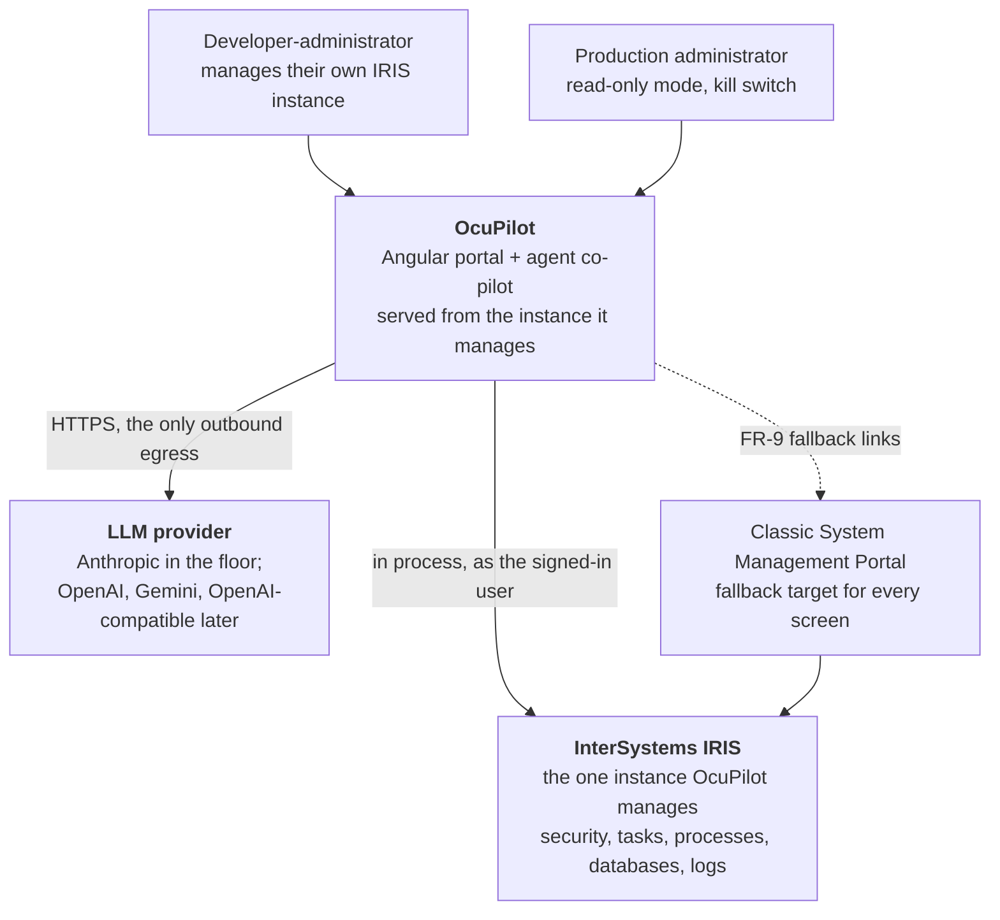
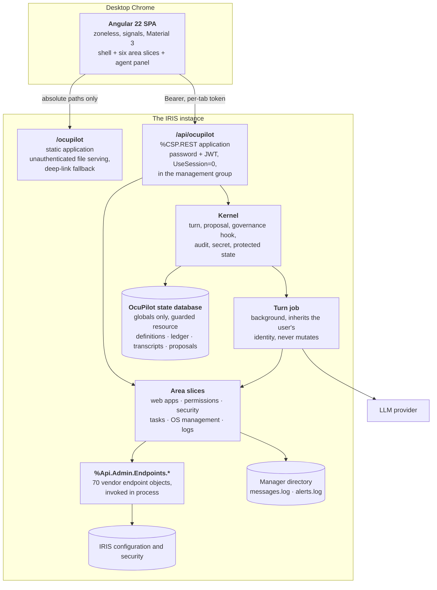
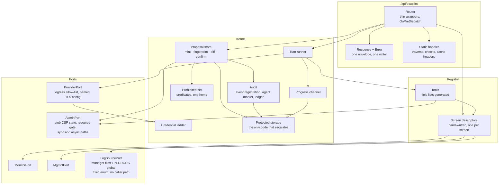
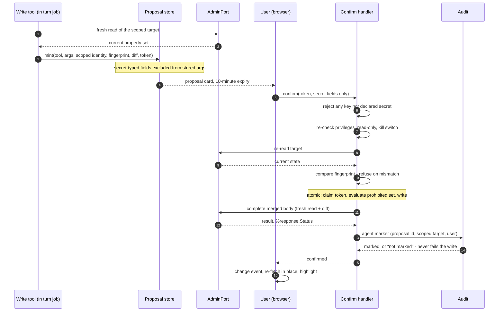

# OcuPilot — C4 model

Four levels. The spine is the contract; this is the shape. Where a diagram and an AD disagree, the AD wins.

## Level 1 — System context

The only data leaving the instance goes to the configured provider, and only what the screen-context cap allows (AD-24, AD-42).

## Level 2 — Containers

## Level 3 — Components inside the instance

## Level 4 — The write path, in code terms

## What each level is good for

| Level | Answers | Audience |
| --- | --- | --- |
| 1 Context | What is OcuPilot, and what does it touch? | Contest judges, Developer Community readers |
| 2 Containers | What is deployed, and what talks to what? | A new contributor's first hour |
| 3 Components | Where does a change go? | Story and epic work |
| 4 Write path | Why is the agent safe? | The claim the whole product rests on |
